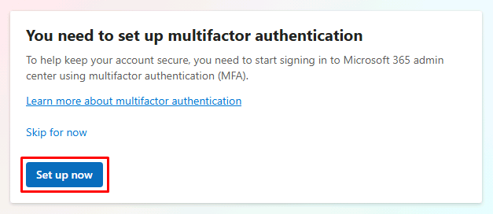
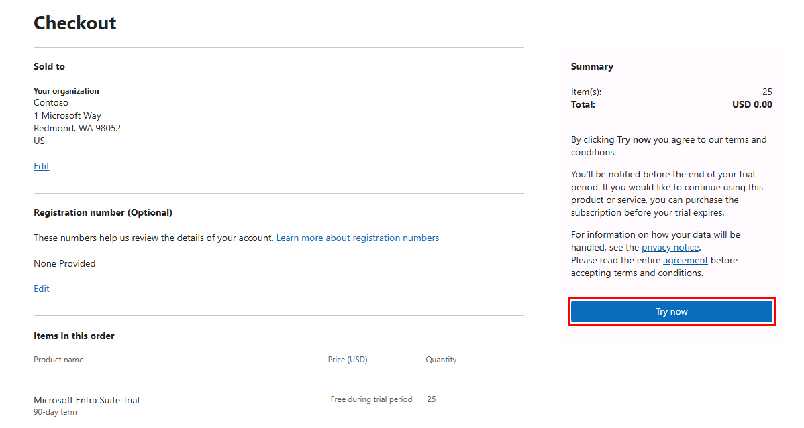
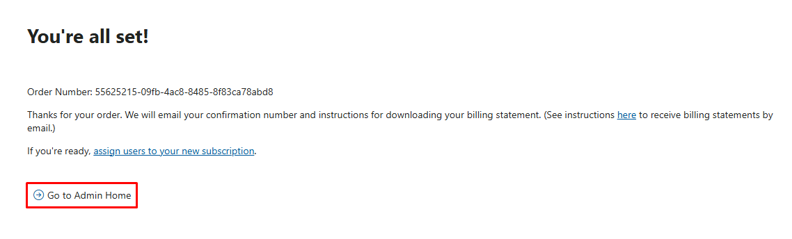

{: .note }
> As you follow the instructions in this pane, you can select highlighted +++Type Text+++ to write it directly into the virtual machine.

## Task 01: Activate the Entra Suite trial
### Introduction
Modern identity security begins with a unified control plane. Microsoft Entra Suite consolidates identity governance, authentication, and network access into a single policy-driven system. This eliminates fragmented controls and allows security decisions to follow identity rather than location.
### Description
In this task, you activate the Entra Suite environment and establish administrative access. This enables all downstream capabilities-such as lifecycle workflows, Conditional Access, and identity-based network controls-to operate under a shared policy engine.
### Example scenario
You're Adele, and on your first day in this new role, your organization enables a unified identity platform. Instead of managing separate systems for access, networking, and security, everything is now governed through a single identity layer that will determine what you can access-and under what conditions.
### Success criteria
- Entra Suite is active and accessible
- Administrative access is established
- Identity services are ready for governance configuration
### Learning resources
- Microsoft Entra overview
- Zero Trust identity principles

---

1. Sign in to the @lab.VirtualMachine(Windows11).SelectLink VM with the following credentials:

	| Item     | Value                                                |
	|:---------|:---------|
	| Username | **@lab.VirtualMachine(Windows11).Username**       |
	| Password | **+++@lab.VirtualMachine(Windows11).Password+++** |

1. Open Microsoft Edge, then go to (admin.cloud.microsoft/?pid=2EBF8FFA-7DE1-4D14-9B15-238F5CA77671&mpid=CFQ7TTC0NZT8%2C0001&ru=signup#/Purchase/trial)[admin.cloud.microsoft/?pid=2EBF8FFA-7DE1-4D14-9B15-238F5CA77671&mpid=CFQ7TTC0NZT8%2C0001&ru=signup#/Purchase/trial].

1. Sign in with your lab credentials:

	| Item     | Value                                                |
	|:---------|:---------|
	| Username | `@lab.CloudCredential(WWLM365Enterprise2019wSPE_EStakeholderKimFrank).AdministrativeUsername`       |
	| Password | `@lab.CloudCredential(WWLM365Enterprise2019wSPE_EStakeholderKimFrank).AdministrativePassword`  |

	{: .warning }
	> You'll need a personal mobile device to set up MFA on the account.

1. In the dialog for MFA, select **Set up now**.

	

1. Follow the onscreen prompts to use the **Microsoft Authenticator** app to enable MFA.

1. Once added, select **Done**.

1. In the rightmost pane of the trial activation page, select **Try now**.

	

1. Once activated, select **Go to Admin Home**.

	
