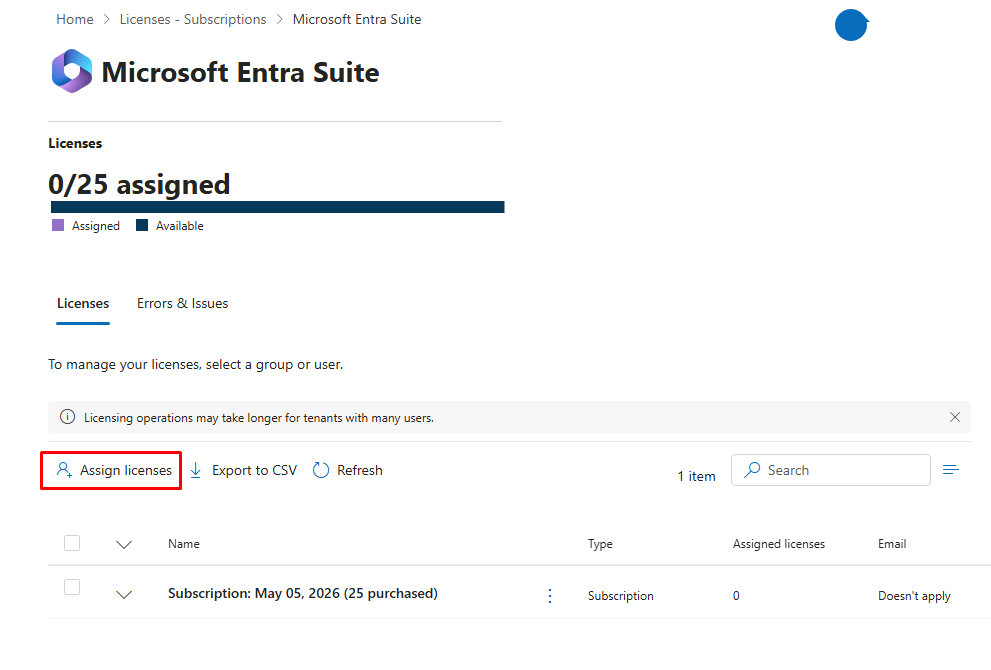
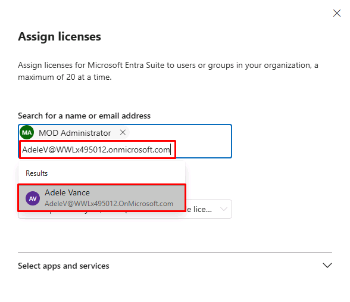
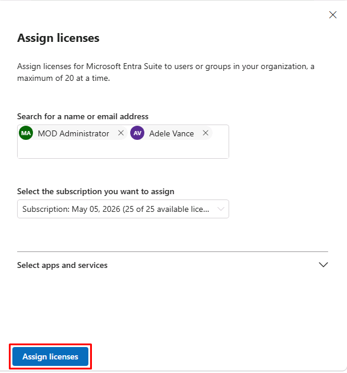

## Task 02: Add licenses
### Introduction
Licensing is what enables capabilities at the identity level. Without proper licensing, advanced governance, risk detection, and access enforcement features aren't available to users.
### Description
You assign Entra Suite licenses to both administrative and user identities. This ensures that your user account (Adele) can participate in automated lifecycle workflows, Conditional Access evaluation, and secure access scenarios later in the lab.
### Example scenario
You're Adele, and your access experience should reflect your role immediately. Behind the scenes, your organization assigns you the necessary licenses so your identity can be evaluated, governed, and protected according to Zero Trust principles.
### Success criteria
- Licenses assigned to required users
- Adele's account has Entra Suite capabilities enabled
- Identity is ready for governance and enforcement scenarios
### Learning resources
- Identity licensing concepts in Microsoft Entra

---

1. In the leftmost pane, go to **Billing** > **Licenses**.

1. Select **Microsoft Entra Suite**.

1. Above the table, select **Assign licenses**.

	

1. In the flyout pane:

    1. Search for and select the following accounts:

        - `@lab.CloudCredential(WWLM365Enterprise2019wSPE_EStakeholderKimFrank).AdministrativeUsername`
        - `AdeleV@@lab.CloudCredential(WWLM365Enterprise2019wSPE_EStakeholderKimFrank).TenantName`

		

	1. At the bottom of the pane, select **Assign licenses**.

		

	1. Close the flyout pane.