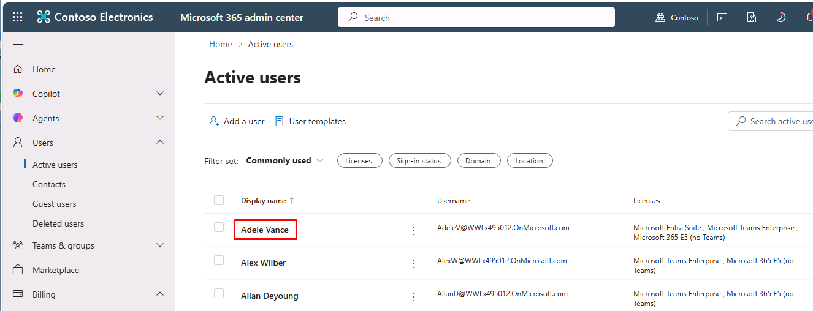
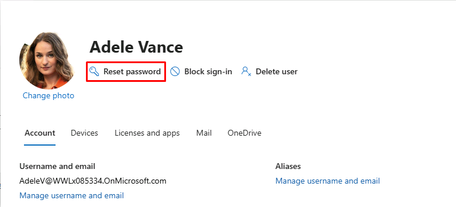
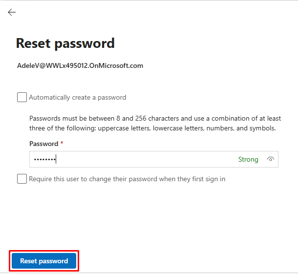

## Task 03: Set up end user account
### Introduction
A user identity is more than just credentials-it includes attributes, authentication methods, and policy context. These attributes drive automated decisions across governance and access enforcement systems.
### Description
You configure Adele's account and authentication setup. This prepares the identity for secure sign-in, multi-factor authentication, and policy evaluation across applications and services.
### Example scenario
You're Adele, signing in for the first time. Your identity is configured with strong authentication methods, ensuring that every access request you make can be validated with high assurance from the start.
### Success criteria
- Adele can sign in successfully
- MFA is configured
- Identity attributes are accessible for policy evaluation
### Learning resources
- Microsoft Authenticator setup
- Identity security best practices

---

1. In the leftmost pane, go to **Users** > **Active users**.

1. Select **Adele Vance**.

	

1. At the top of the flyout pane, select **Reset password**.

	

1. Clear the following checkboxes:

	- **Automatically create a password**
    - **Require this user to change their password...**
    
1. Enter the following password:

	`rag-sim6` 

1. At the bottom of the pane, select **Reset password**.

	

1. Close the pane.

1. On the VM's taskbar, open Google Chrome, then go to `entra.microsoft.com`.

1. Sign in with **Adele Vance**'s account:

	| Item     | Value                                                |
	|:---------|:---------|
	| Username | `AdeleV@@lab.CloudCredential(WWLM365Enterprise2019wSPE_EStakeholderKimFrank).TenantName`       |
	| Password | `rag-sim6`  |

1. Follow the onscreen prompts to use the **Microsoft Authenticator** app to enable MFA.