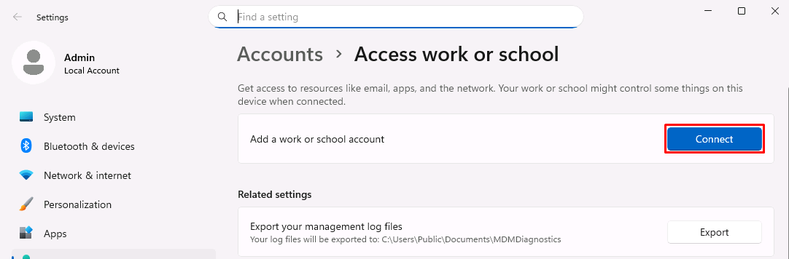
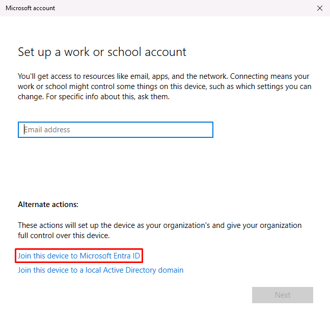
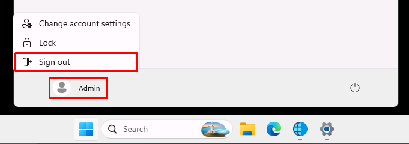

## Task 04: Join GSA VM to Entra
### Introduction
Device identity is just as important as user identity in a Zero Trust model. A trusted device provides context that policies use to determine whether access should be granted.
### Description
The **GSA** VM in your lab will serve as Adele's Entra-joined corporate device in Exercise 02. The Global Secure Access Client requires the device to be Entra-joined, with the user signed in with their Entra account. You'll join a device to Microsoft Entra and associate it with Adele's identity. This creates a trusted endpoint that can be evaluated by Conditional Access and Global Secure Access policies. 
### Example scenario
You're Adele, working from a corporate-issued device. By joining your device to Entra, your organization can securely verify not just who you are-but also that your device meets compliance and trust requirements.
### Success criteria
- Device successfully joined to Entra
- Adele can sign in to the device
- Device is recognized as corporate and trusted
### Learning resources
- Entra device registration concepts

---

1. Switch to the **@lab.VirtualMachine(GSA).SelectLink** virtual machine.

	{: .highlight }
	> You can select **@lab.VirtualMachine(GSA).SelectLink** or swap between VMs through the **Resources** tab of this **Instructions** pane.

1. Sign in with the following credentials:

	| Item     | Value                                                |
	|:---------|:---------|
	| Username | **@lab.VirtualMachine(GSA).Username**       |
	| Password | **@lab.VirtualMachine(GSA).Password** |

1. In the taskbar's search box, enter and select `Access work or school`.

1. Select **Connect**.

	

1. At the bottom of the dialog, select **Join this device to Microsoft Entra ID**.

	

1. Sign in with Adele's credentials:

	| Item     | Value                                                |
	|:---------|:---------|
	| Username | `AdeleV@@lab.CloudCredential(WWLM365Enterprise2019wSPE_EStakeholderKimFrank).TenantName` |
	| Password | `rag-sim6` |

1. In the dialog, select **Join**.

1. Once connected, select **Done**.

1. Select the **Start** menu, then select **Admin** > **Sign out**.

	

1. In the lower-left corner of the screen, select **Other user**.

1. Sign in with Adele's Entra credentials:

    | Item | Value |
    |:---------|:---------|
    | Username | AdeleV@@lab.CloudCredential(WWLM365Enterprise2019wSPE_EStakeholderKimFrank).TenantName |
    | Password | rag-sim6 |