## Task 01: Role transfer and automatic provisioning
### Introduction
Identity governance enforces least privilege by continuously aligning access to user attributes. Lifecycle workflows automate this process, ensuring access evolves as roles change-without manual intervention.
### Description
You configure access packages, policies, and workflows that react to attribute changes. When Adele's department changes, her previous access is removed and new access is provisioned automatically.
### Example scenario
You're Adele, and your role changes to Senior Product Marketer. Overnight, your access is updated automatically: outdated permissions are removed, and the tools you need appear instantly. You don't submit a single access request-it's already done.
### Success criteria
- Access package created and assigned
- Old access removed automatically
- New role-based access granted
### Learning resources
- Identity Governance in Microsoft Entra

---

### Key steps

#### 01: Enable FIDO2 passkeys

In this step, you'll configure passkeys (FIDO2) for use in your tenant. Passkeys are phishing-resistant credentials that replace passwords entirely. Users authenticate with the device's biometric or PIN, with no password to type or phish.

1. Switch back to the **@lab.VirtualMachine(Windows11).SelectLink** virtual machine.

	{: .highlight }
	> You can select **@lab.VirtualMachine(Windows11).SelectLink** or swap between VMs through the **Resources** tab of this **Instructions** pane.

1. Switch to your Microsoft Edge window.

	{: .highlight }
	> Signed in with your lab's admin credentials, not Adele's account.

1. Open a new tab, then go to `entra.microsoft.com`.

1. In the leftmost pane, go to **Entra ID** > **Authentication methods**.

	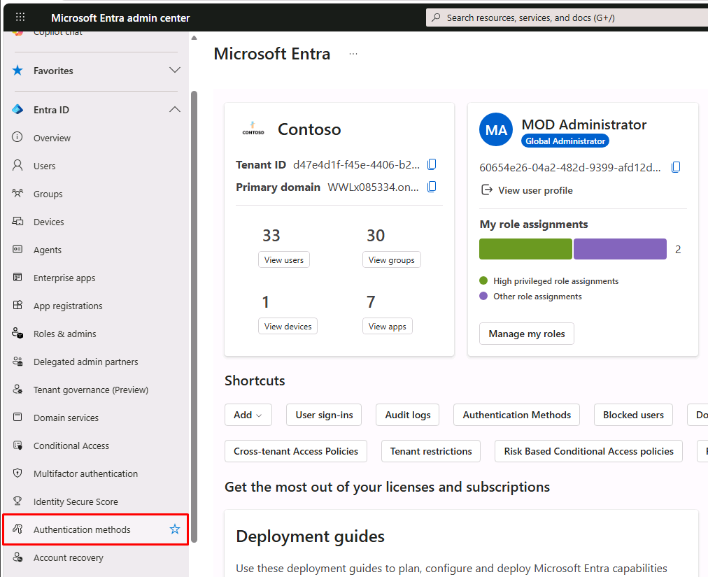

1. Select **Passkey (FIDO2)**.

	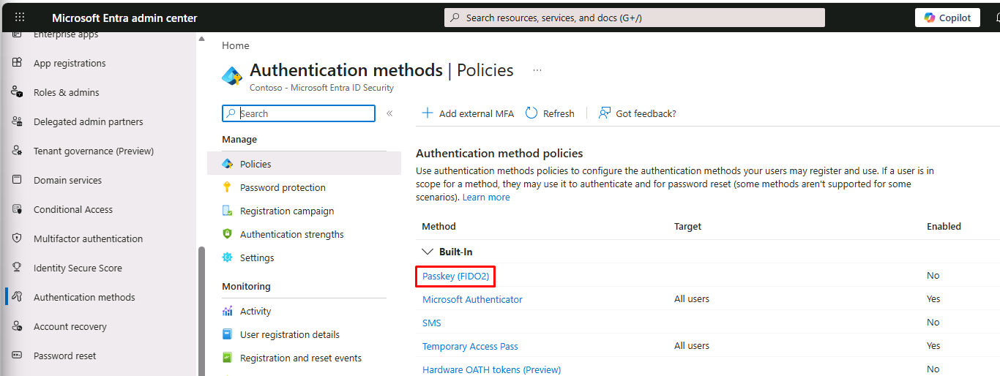

1. Under the **Enable and Target** tab, verify that it's set to **Enable**.

	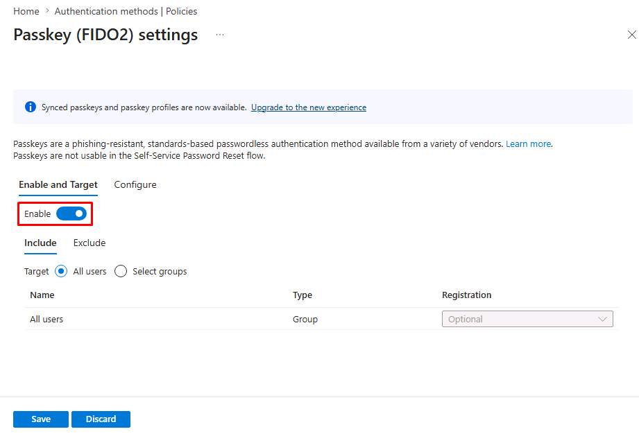

1. Near the top of the page, select the **Configure** tab.

1. Verify **Allow self-service setup** is checked.

	{: .important }
	> If disabled, users can't register a passkey from their personal security info page, even if passkeys (FIDO2) are enabled by the authentication methods policy. 

1. At the bottom of the page, select **Save**.

---

#### 02: Review Adele's pre-provisioned attributes

Before configuring the lifecycle controls, you'll take a look at Adele's pre-provisioned attributes the lifecycle automation depends on.

1. In the leftmost pane, go to **Entra ID** > **Users**.

1. Select **Adele Vance**.

1. Copy the value of **Object ID** and paste it in the following text box:

	@lab.TextBox(adeleObjectId)

    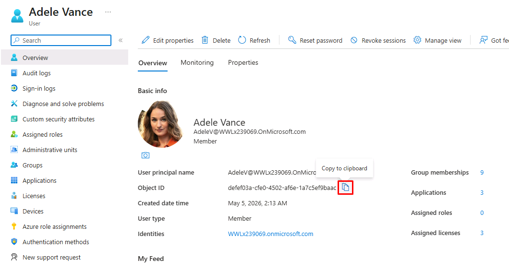

    {: .warning }
    > The pasted value will be referenced in a later task.

1. Under the top bar, select the **Properties** tab.

	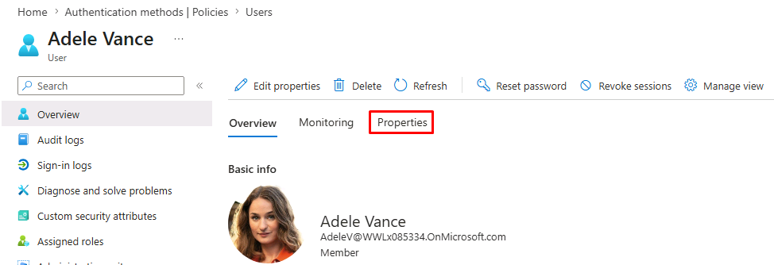

1. Move down to the **Job information** section to observe her current details:

    | Item | Value |
    |---|---|
    | Job title | **Retail Manager** |
    | Department | **Retail** |
    | Manager | **Miriam Graham** |

---

#### 03: Create the access package

An access package bundles the resources a user needs for a specific role (groups, applications, SharePoint sites) along with policies that determine how access is granted. 

1. In the leftmost pane, go to **ID Governance** > **Entitlement management**.

1. In the page's menu, under **Entitlement management**, select **Access packages**.

	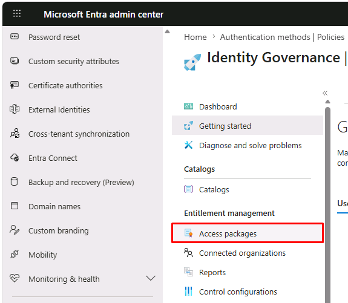

1. On the top bar, select **New access package**.

	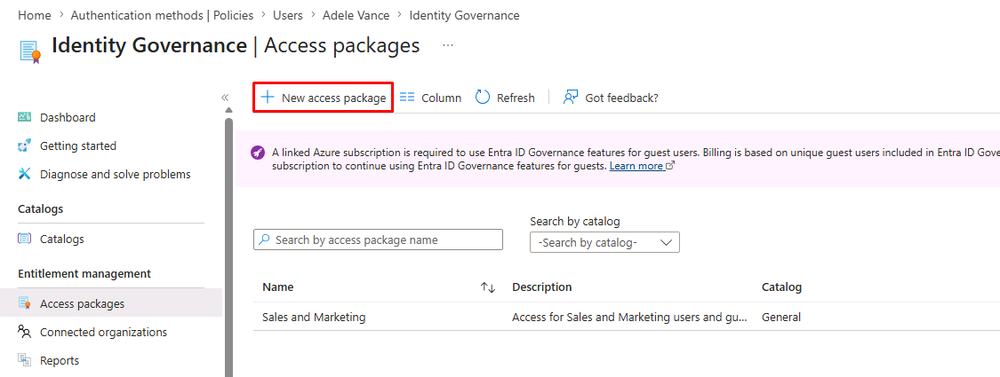

1. On the **Basics** tab, enter the following:

    | Item | Value |
    |---|---|
    | Name | `IoT PMM Baseline` |
    | Description | `Baseline access for the IoT Product Marketing Manager role.` |
    | Catalog | **General** |

1. Select **Next: Resource roles**.

1. On the **Resource roles** tab, select **Groups and Teams**.

	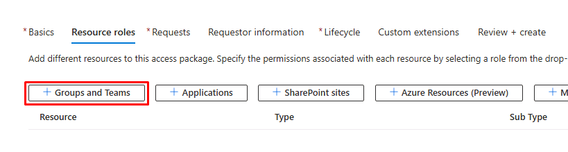

1. In the flyout pane:

	1. At the top of the pane, select the checkbox for **See all Group and Team(s)...**

		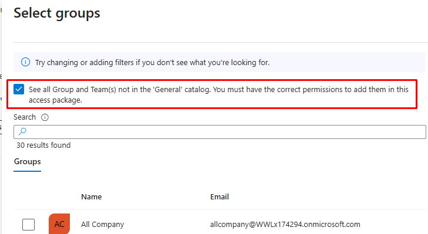

    1. In the search box, enter and select `sg-Engineering`.

    	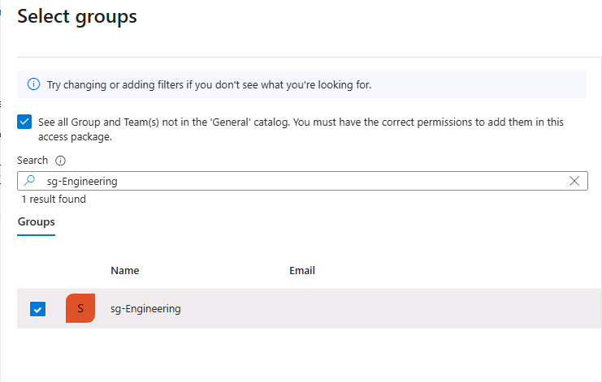

    1. At the bottom of the pane, choose **Select**.

1. In the **Role** column for **sg-Engineering**, select the dropdown menu, then select **Member**.

	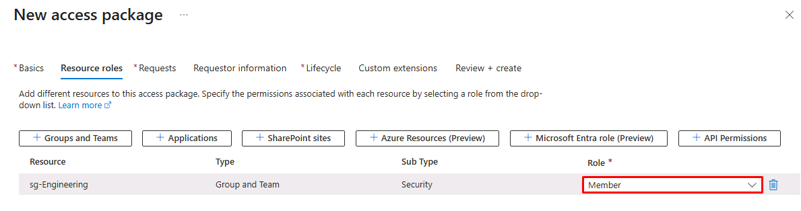

    {: .important }
    > You're using the existing **sg-Engineering** security group as the resource for the IoT PMM Baseline access package. 

1. Select **Next: Requests**.

1. On the **Requests** tab, under **Who can get access**, keep **None (administrator direct assignments only)**.

    {: .important }
    > You're selecting administrator direct assignments here because access will be granted via the **automatic assignment policy** you'll create next.

1. Under **Approval**, set **Require approval** to **No**.

	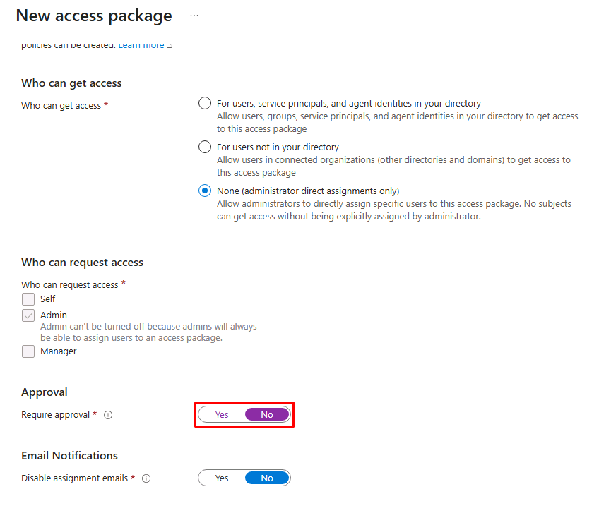

    {: .important }
    > No approval is needed because no users are requesting this access package. The auto-assignment policy will grant access automatically based on attribute match.

1. Select **Next: Requestor information**.

1. Select **Next: Lifecycle**.

1. On the **Lifecycle** tab, verify the following details:

    | Item | Value |
    |---|---|
    | Access package assignments expire | **Number of days** |
    | Number of days | `365` |

1. Select **Review + create**.

1. Review the configuration, then select **Create**.

	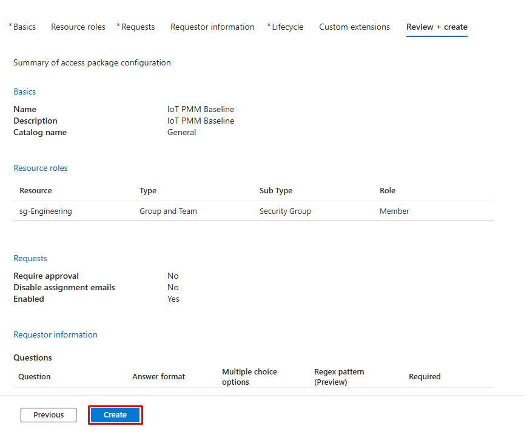

{: .important }
> You added a security group to the package, but access packages can also wrap applications, SharePoint sites, Azure resources, Entra roles, and API permissions for service principal and agent identities.

---

#### 04: Configure the auto-assignment policy

An automatic assignment policy evaluates user attributes against a membership rule and automatically adds or removes them.

1. On the **IoT PMM Baseline** page's menu, select **Policies**.

	
    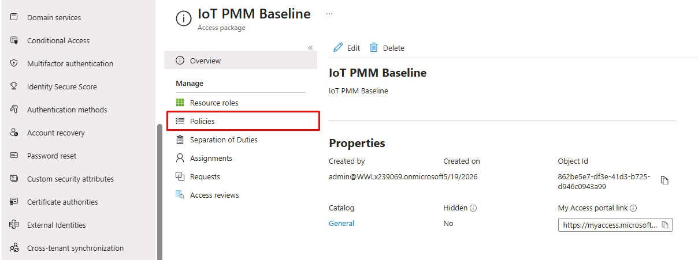

1. On the top bar, select **Add auto assignment policy**.

	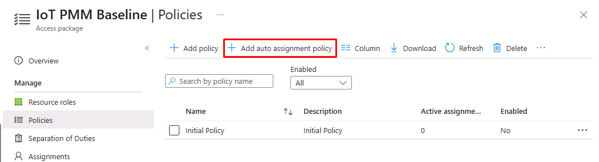

1. In the upper-right corner of the **Rule Syntax** box, select **Edit**.

	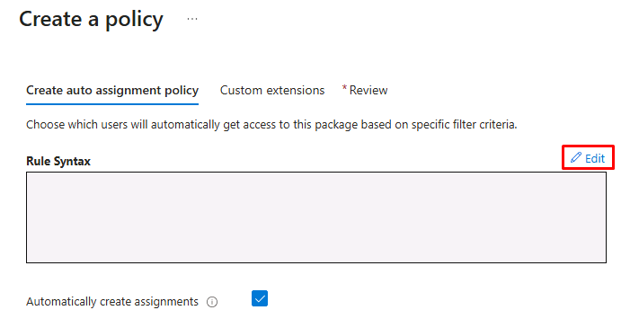

1. At the bottom of the page, in the upper-right corner of the **Rule Syntax** box, select **Edit**.

	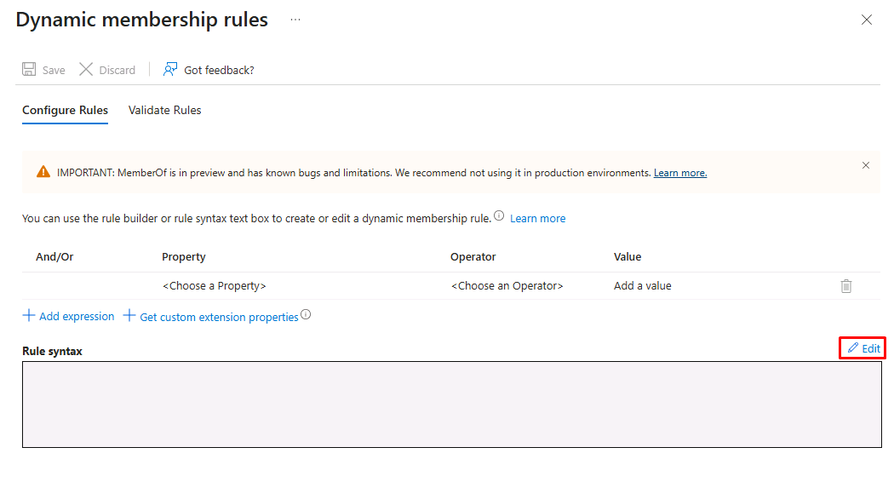

1. In the flyout pane:

	1. Enter the following:

    	`(user.department -eq "IoT Marketing")`

    1. At the bottom of the pane, select **OK**.

1. Confirm the rule appears in the **Rule syntax** box, then select **Save** at the top of the page.

	
    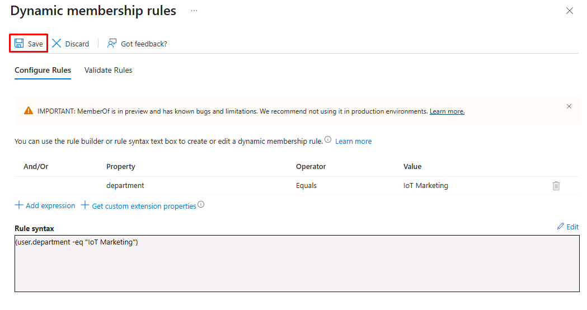

1. Verify both checkboxes are selected:

    - **Automatically create assignments**
    - **Automatically remove assignments**

1. Select **Next** until you reach the **Review** tab.

1. On the **Review** tab, enter the following:

    | Item | Value |
    |---|---|
    | Name | `Auto-assign IoT Marketing department users` |
    | Description | `Grants IoT PMM Baseline access to users with Department = IoT Marketing.` |

1. Select **Create**.

    {: .important }
    > Entitlement management additionally creates a unique dynamic security group automatically to evaluate the rule. Do not modify or delete this group.

---

#### 05: Create the mover lifecycle workflow

Lifecycle workflows automate user lifecycle management across the joiner, mover, and leaver phases. The mover workflow you'll create will remove Adele's old access after a role change and notify her manager.

1. In the leftmost pane, go to **ID Governance** > **Lifecycle workflows**.

1. On the top bar, select **Create workflow**.

	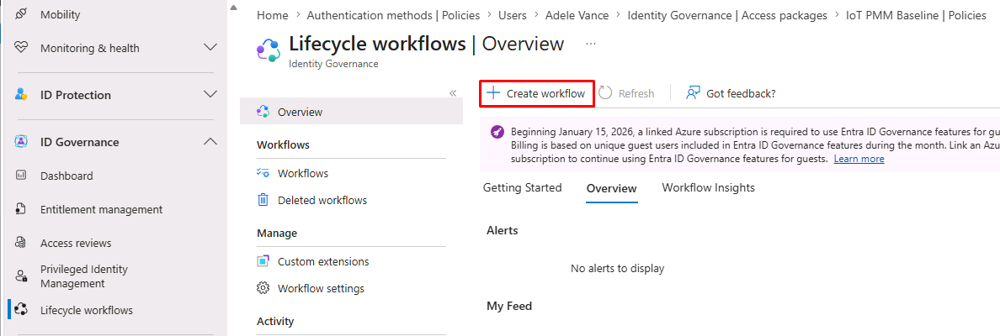

1. In the **Mover** tile for `Employee job profile change`, choose **Select**.

	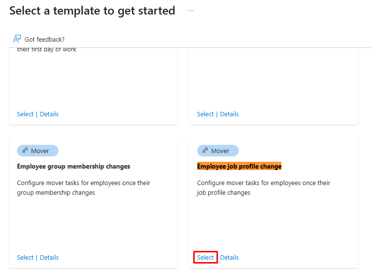

1. On the **Basics** tab, enter the following:

    | Item | Value |
    |---|---|
    | Name | `Marketing role transfer mover` |
    | Description | `Removes stale entitlements and notifies the manager when a marketing employee's department changes.` |
    | Trigger type | **Attribute changes** |
    | Trigger attribute | **department** |

    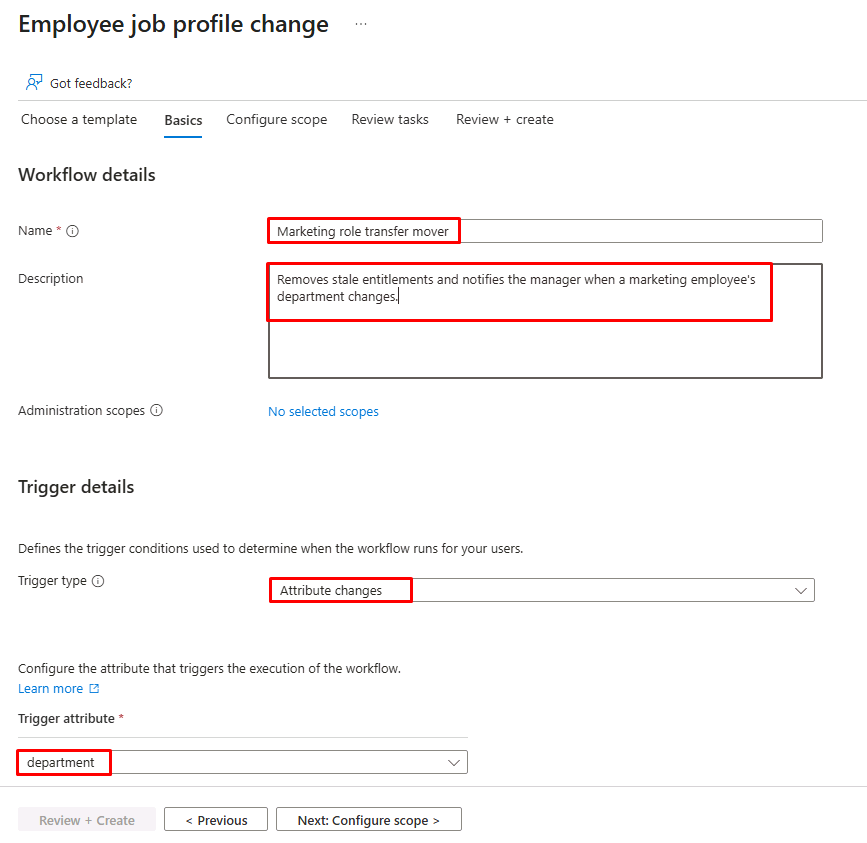

1. Select **Next: Configure scope**.

1. Under the **Rule** section, adjust the following values:

    | Item | Value |
    |---|---|
    | Property | **department** |
    | Operator | **equal** |
    | Value | `IoT Marketing` |

    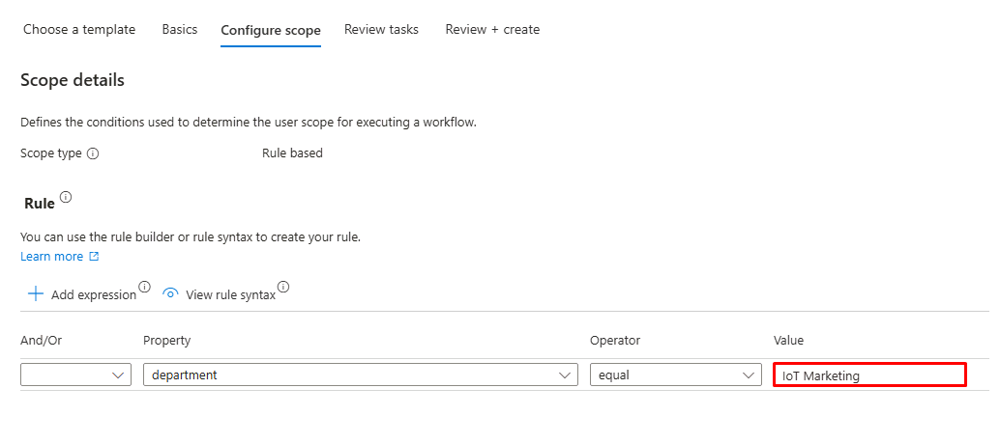

    {: .important }
    > The **trigger** fires when any user's **department** attribute changes. The **scope** filters the trigger so the workflow only runs for users whose new department is set to **IoT Marketing**.

1. Select **Next: Review tasks**.

1. Under the **Workflow tasks** section, select **Remove user from selected groups**.

	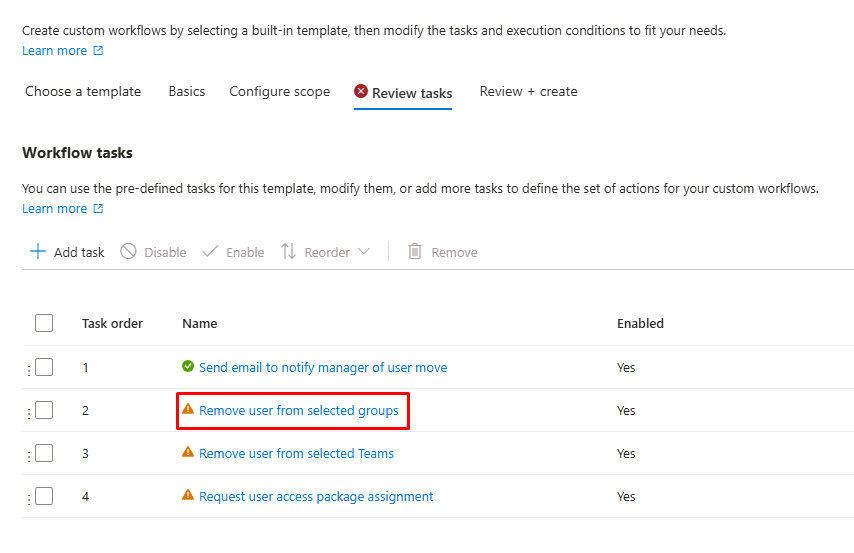

1. In the flyout pane:

    1. Select **0 Groups selected**.
    	
        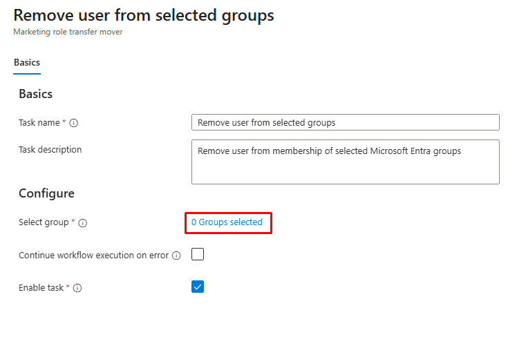

    1. In the search box, enter and select `sg-Sales and Marketing`.

    1. At the bottom of the pane, choose **Select**.

    1. At the bottom of the pane, select **Save**.

1. Select **Remove user from selected Teams**.

	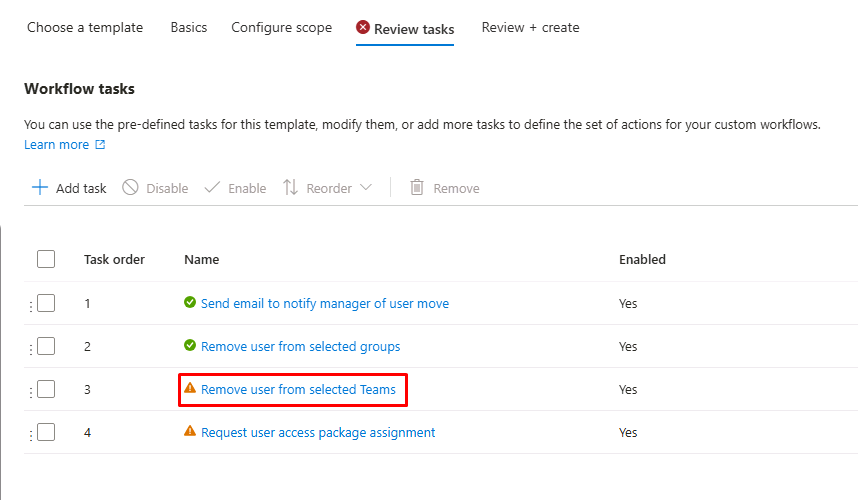

1. In the flyout pane:

    1. Select **0 Teams selected**.

    1. In the search box, enter and select the `Retail` team.

    1. At the bottom of the pane, choose **Select**.

    1. At the bottom of the pane, select **Save**.

1. Select **Request user access package assignment**.

1. In the flyout pane:

	1. Under **Access package**, select **No Access package selected**.

	1. Select **IoT PMM Baseline**.

    	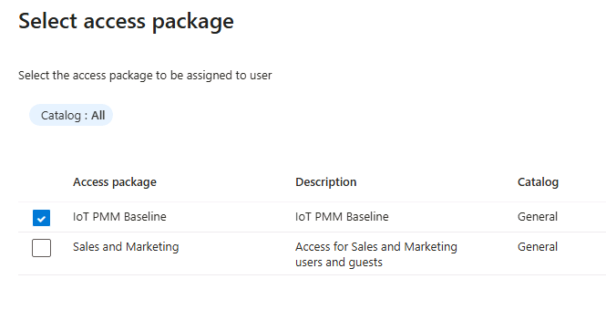

	1. At the bottom of the pane, choose **Select**.

	1. Under **Policy**, select the dropdown menu, then select **Auto-assign IoT Marketing department users**.

    	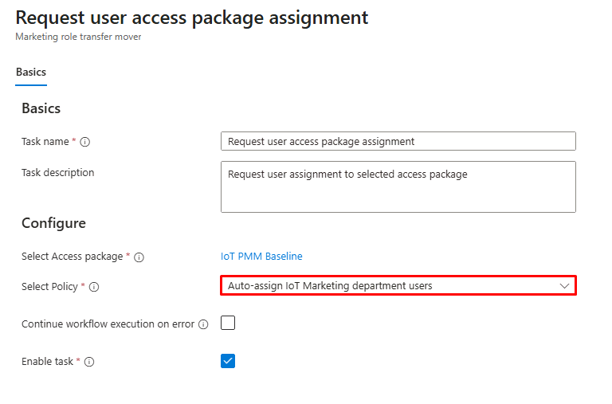

	1. At the bottom of the pane, select **Save**.

1. Select **Next: Review + create**.

1. Under the **Schedule workflow** section, select **Enable schedule**.

	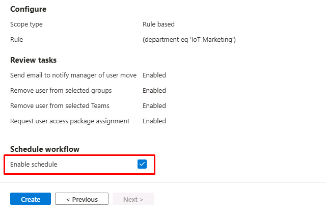

	{: .important }
	> By default, workflows are scheduled to run every 3 hours, but you can set the interval to be as frequent as 1 hour or as infrequent as 24 hours.
	>
	> To run the workflow immediately for testing, you'll trigger it manually in a later step.

1. Select **Create**.

---

#### 06: Configure an ML-assisted access review

Access reviews with machine learning-assisted decision recommendations help reviewers make faster, more accurate decisions. 

You'll review membership of the **sg-Engineering** group, which is the resource granted by the IoT PMM Baseline access package. Reviewing this group effectively reviews who has gained access through the package.

1. In the leftmost pane, go to **ID Governance** > **Access reviews**.

1. On the top bar, select **New access review**.

	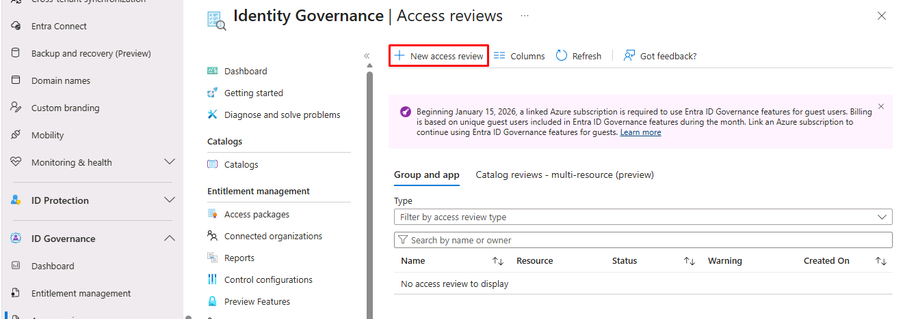

1. In the tile for **Review access to a resource type**, choose **Select**.

	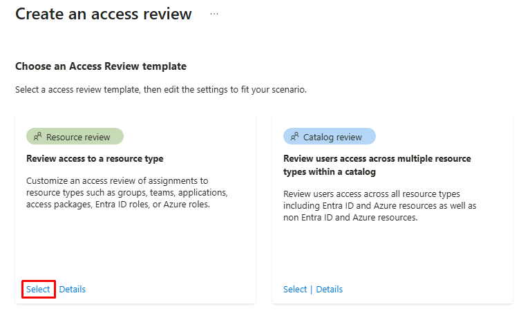

1. On the **Select what to review** tab, use the following selections:

    | Item | Value |
    |---|---|
    | Select what to review | **Teams + Groups** |
    | Review scope | **Select Teams + groups** |

1. Choose **Select group(s)**.

	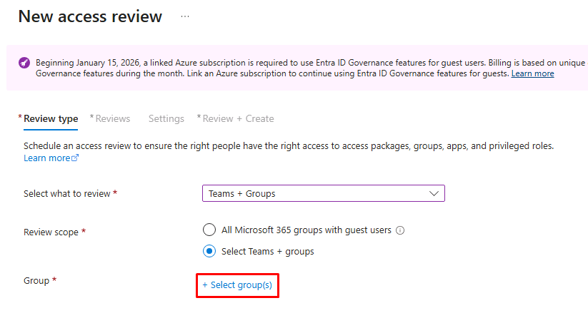

1. In the flyout pane:

	1. In the search box, enter and select `sg-Engineering`.
	
	1. At the bottom of the pane, choose **Select**.

1. For **Scope**, select **All users**.

	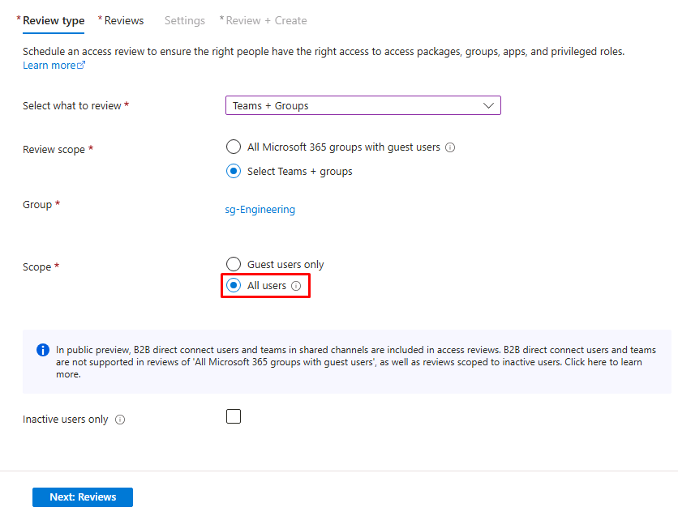

1. Select **Next: Reviews**.

1. Under **Specify reviewers**:

    | Item | Value |
    |---|---|
    | Select reviewers | **Managers of users** |

1. Under the **Specify recurrence and review** section, enter the following:

    | Item | Value |
    |---|---|
    | Duration (in days) | `7` |
    | Review recurrence | **Quarterly** |	
    | Start date | Keep today's date |
    | End | **Never** |

    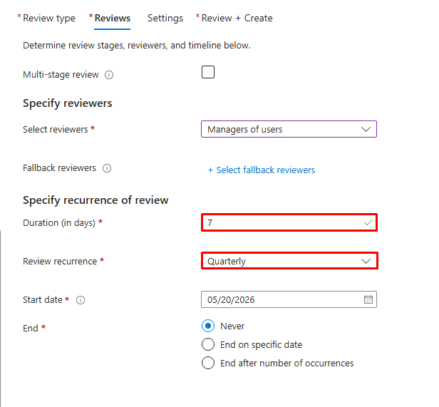

1. Select **Next: Settings**.

1. On the **Settings** tab, set the following:

    | Item | Value |
    |---|---|
    | Auto apply results to resource | **Enable** |

    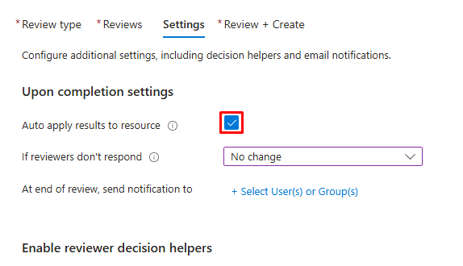

	{: .important }
	>With **Auto apply results to resource** enabled, accepted decisions are enforced automatically when the review closes. Denied users are removed from **sg-Engineering**, which cascades through the access package to remove their assignment entirely.

1. Under the **Enable reviewer decision helpers** section, enable the following:

    - **No sign-in within 30 days**
    - **User-to-Group affiliation**
    
		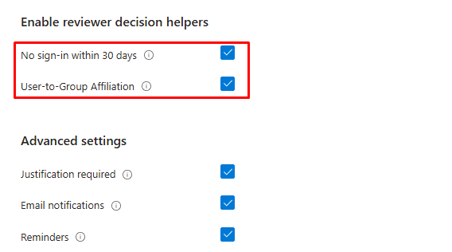

1. Select **Next: Review + Create**.

1. On the **Review + Create** tab, enter the following:

    | Item | Value |
    |---|---|
    | Review name | `sg-Engineering quarterly review` |
    | Description | `Quarterly access review of sg-Engineering members with ML-assisted decision helpers.` |

1. Select **Create**.

---

#### 07: Trigger Adele's role change

In this step, you'll manually update Adele's department directly. In a real-world environment, the customer's HR system could push that role change overnight. 

1. In the leftmost pane, go to **Entra ID** > **Users**.

1. Select **Adele Vance**.

1. On the top bar, select **Edit properties**.

	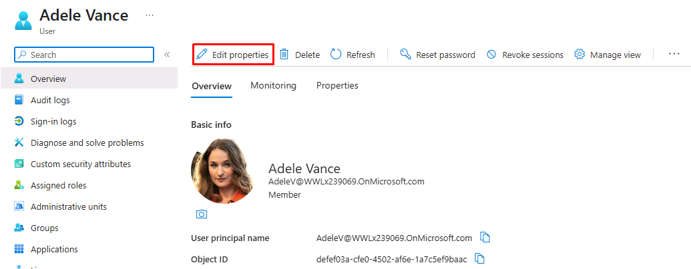

1. Select the **Job Information** tab.

1. Update the following:

    | Item | Value |
    |---|---|
    | Job title | `Senior Product Marketer` |
    | Department | `IoT Marketing` |

    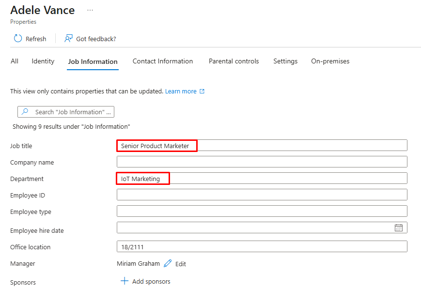

1. At the bottom of the page, select **Save**.

    {: .note }
    > This change drives the mover workflow via the attribute-change trigger, and the auto-assignment policy via the membership rule.

---

#### 08: Run the mover workflow on demand

Scheduled lifecycle workflows check execution conditions every three hours by default. You'll run the workflow on-demand against Adele.

1. In the leftmost pane, go to **ID Governance** > **Lifecycle workflows**.

1. In the **Lifecycle workflows** page's menu, select **Workflows**.

	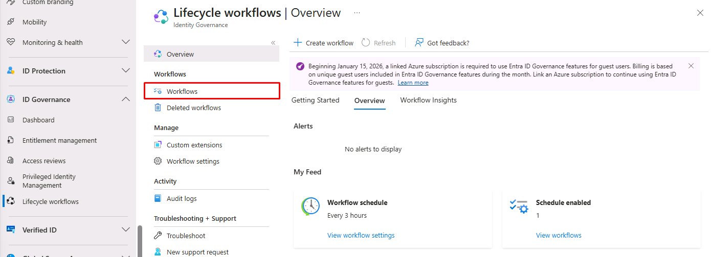

1. Select **Marketing role transfer mover**.

1. On the top bar, select **Run on demand**.

	
	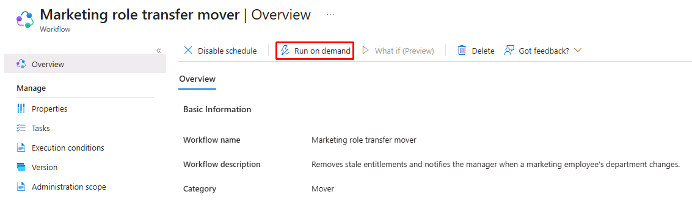

1. Choose **Select users**.

1. In the flyout pane:

    1. Select `Adele Vance`.

	1. At the bottom of the pane, choose **Select**.

1. At the bottom of the page, select **Run workflow**.

	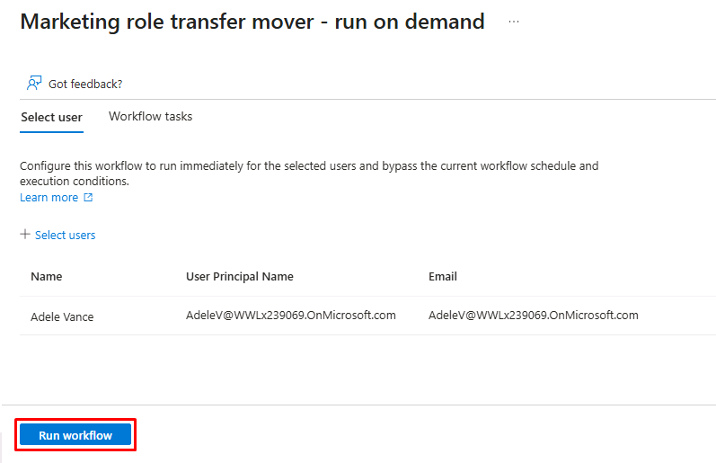

	{: .note }
	> This will take you to the **Workflow history** page.

1. On the top bar, periodically select **Refresh** until the run for Adele appears.

	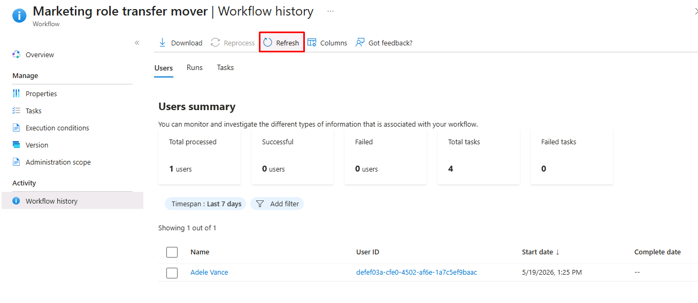

1. Select **Adele Vance** to view the task results.

1. Observe the tasks it ran in the flyout pane. All tasks should show **Completed**.

	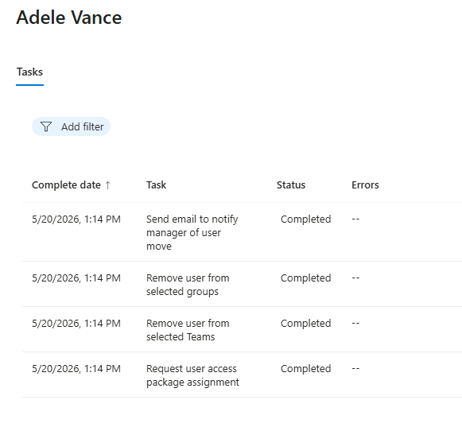

	{: .warning }
	> If it's not finished, refresh the table and try again. If it hangs for over five minutes, try running the workflow again.

---

#### 09: Verify auto-assignment

1. In the leftmost pane, go to **ID Governance** > **Entitlement management**.

1. In the page's menu, under **Entitlement management**, select **Access package**.

1. Select **IoT PMM Baseline**.

	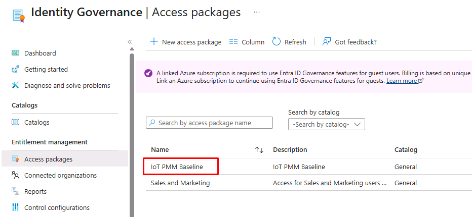

1. In the page's menu, select **Assignments**.

1. On the entry for Adele Vance, observe the **Policy** column shows **Auto-assign IoT Marketing department users**.

	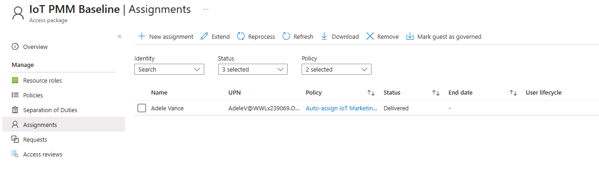

    {: .warning }
    > It may take around five minutes to evaluate the new department attribute and create the assignment. Select **Refresh** on the top bar periodically.

1. In the leftmost pane, go to **Entra ID** > **Users**.

1. Select **Adele Vance**.

1. In the page's menu, select **Groups**.

	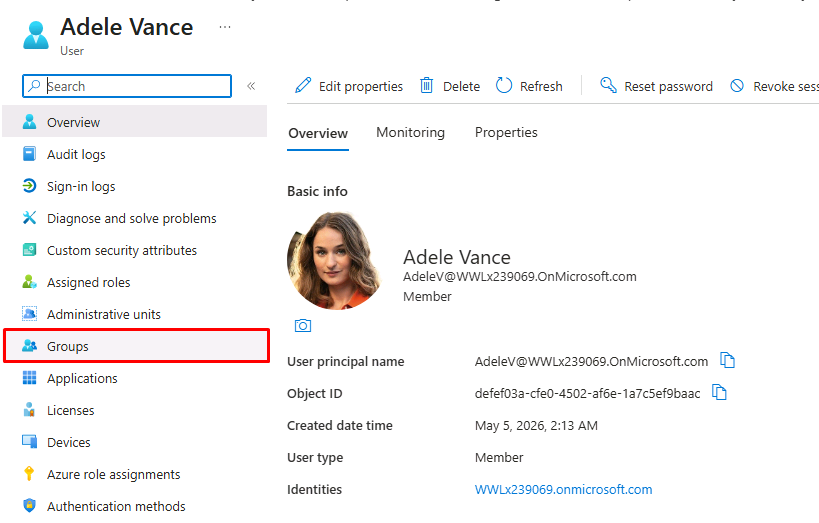

1. Confirm Adele is now part of **sg-Engineering**.

1. Confirm she's no longer a member of:

	- **Retail**
    - **sg-Sales and Marketing**

{: .important }
> Access follows attribute, attribute follows reality, and provisioning is automatic and auditable.
>
> Each time Adele's group memberships change, Conditional Access re-evaluates her scope on her next token request. Policies that target **sg-Engineering** members now apply to her. Policies that targeted **sg-Sales and Marketing** no longer do.
