## Task 02: Risk detection and real-time token revocation

### Introduction
Trust must be continuously evaluated. Risk-based policies ensure that compromised identities are detected and controlled in real time.
### Description
In this task, you'll tour ID Protection, configure Conditional Access risk policies, and review how Continuous Access Evaluation enforces real-time revocation. You configure risk-based Conditional Access policies and simulate a high-risk scenario. When Adele's account is flagged, access is immediately restricted, and active sessions are revoked.
### Example scenario
You're Adele, working normally when your account is suddenly flagged as high risk due to suspicious sign-in activity. Instantly, your sessions are revoked, and you're prompted to reauthenticate-protecting your data before any damage occurs.
### Success criteria
- Risk policies triggered successfully
- Sessions revoked in real time
- Secure reauthentication enforced
Learning resources
- Identity Protection and CAE

---

### Key steps

#### 01: Configure the user risk Conditional Access policy

{: .important }
> **User risk** represents the cumulative likelihood that an account has been compromised over time. A user-risk policy responds to elevated user risk by requiring strong reauthentication before allowing access.

1. In the leftmost pane, go to **Entra ID** > **Conditional Access**.

1. On the top bar, select **Create new policy**.

	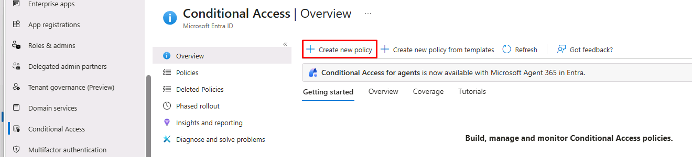

1. In the **Name** box, enter:

	```
	CA01 - Require MFA for high user risk
	```

1. Under **Users or agents**, select **0 users or agents selected**.

    1. Under **Include**, select **All users**.

    	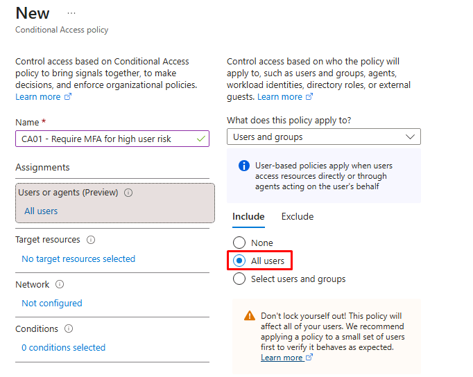

    1. Select the **Exclude** tab.
	
	1. Select the **Users and groups** checkbox.

	1. Enter and select `@lab.CloudCredential(WWLM365Enterprise2019wSPE_EStakeholderKimFrank).AdministrativeUsername`.

        {: .important }
        > Always exclude break-glass and admin accounts from risk-based policies to prevent lockout.

	1. At the bottom of the pane, choose **Select**.

    	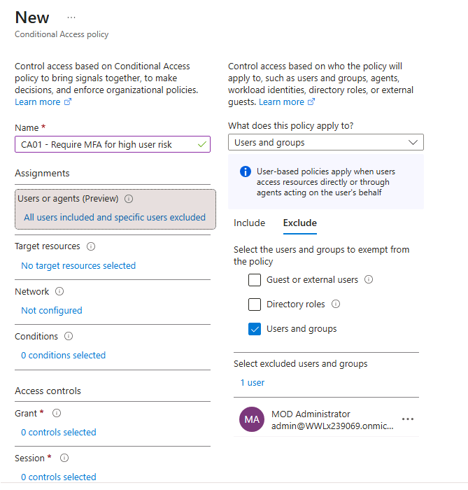

1. Under **Target resources**, select **No target resources selected**.

    1. Under **Include**, select **All resources (formerly 'All cloud apps')**.

    	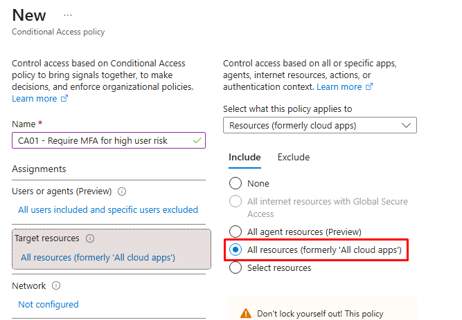

1. Under **Conditions**, select **0 conditions selected**.

	1. Under **User risk**, select **Not configured**.

    1. In the flyout pane, set **Configure** to **Yes**.

    1. Select **High**.

    	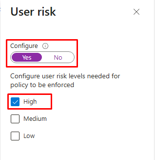

    1. At the bottom of the pane, select **Done**.

1. Under **Grant**, select **0 controls selected**.

    1. In the flyout pane, select **Grant access**.

    1. Select the **Require authentication strength** checkbox, then verify **Multifactor authentication** is selected.

    	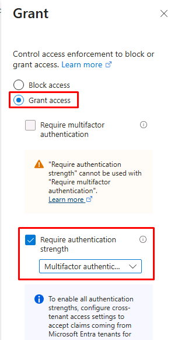

    1. At the bottom of the pane, choose **Select**.

        {: .important }
        > In a real-world environment, Microsoft recommends pairing the user risk policy with **Require risk remediation**, which runs a secure password change or strong reauthentication flow that automatically clears the user's risk state. 

1. Set **Enable policy** to **On**.

	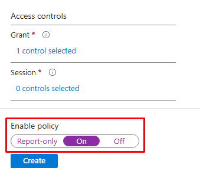

1. At the bottom of the page, select **Create**.

---

#### 02: Configure the sign-in risk Conditional Access policy

Sign-in risk represents the likelihood a specific authentication request isn't from the legitimate user. A sign-in risk policy responds in real time to a suspicious sign-in.

1. On the top bar, select **Create new policy**.

1. In the **Name** box, enter:

	```
	CA02 - Require MFA for high or medium sign-in risk
	```

1. Under **Users or agents**, select **0 users or agents selected**.

    1. Under **Include**, select **All users**.

    1. Select the **Exclude** tab.

    1. Select the **Users and groups** checkbox.

    1. Enter and select `@lab.CloudCredential(WWLM365Enterprise2019wSPE_EStakeholderKimFrank).AdministrativeUsername`.

    1. At the bottom of the pane, choose **Select**.

    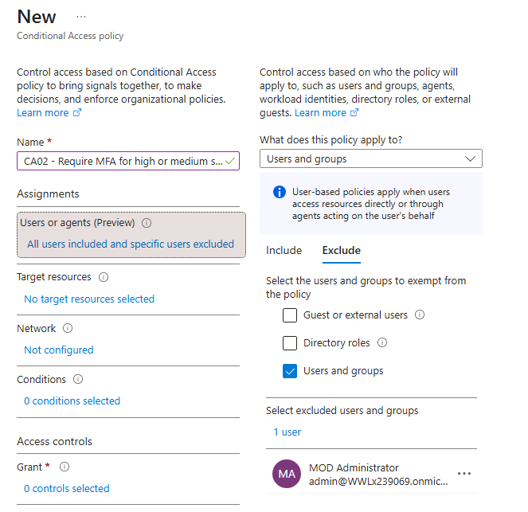

1. Under **Target resources**, select **No target resources selected**.

    1. Under **Include**, select **All resources (formerly 'All cloud apps')**.

1. Under **Conditions**, select **0 conditions selected**.

    1. Under **Sign-in risk**, select **Not configured**.

    	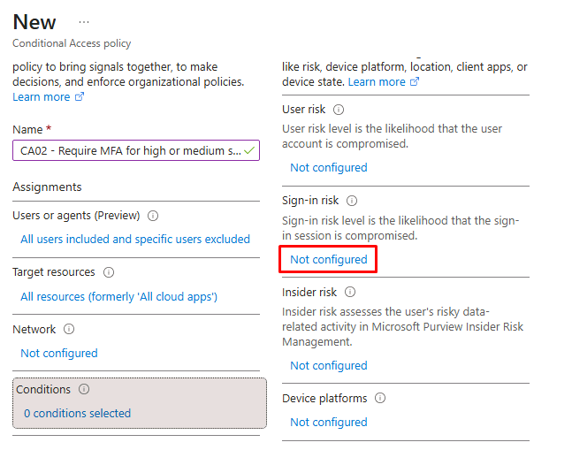

    1. In the flyout pane, set **Configure** to **Yes**.

    1. Select **High** and **Medium**.

    	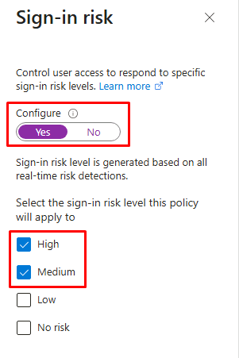

    1. At the bottom of the pane, select **Done**.

1. Under **Grant**, select **0 controls selected**.

    1. In the flyout pane, select **Grant access**.

    1. Select the **Require authentication strength** checkbox, then verify **Multifactor authentication** is selected.

    1. At the bottom of the pane, choose **Select**.

1. Set **Enable policy** to **On**.

	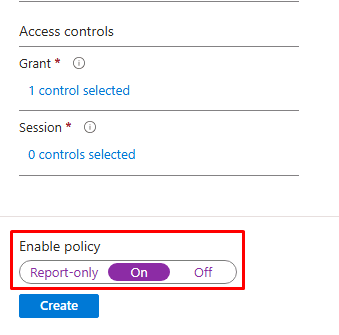

1. At the bottom of the page, select **Create**.

---

#### 03: Simulate a risk detection on Adele

You'll manually elevate Adele's user risk to **High** to simulate a risk detection and trigger the **CA01** policy.

1. In a new browser tab, go to `developer.microsoft.com/graph/graph-explorer`.

1. In the upper-right corner of the page, select the **Sign in** icon.

	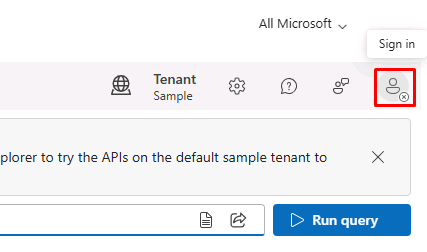

1. In the dialog, select **@lab.CloudCredential(WWLM365Enterprise2019wSPE_EStakeholderKimFrank).AdministrativeUsername**.

1. In the permissions dialog, select **Accept**.

	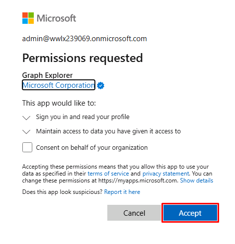

1. At the top of the page, configure the request:

	| Item | Value |
	|---|---|
	| HTTP method | **POST** |
	| API version | **v1.0** |
	| URL | `https://graph.microsoft.com/v1.0/identityProtection/riskyUsers/confirmCompromised` |

    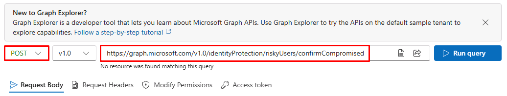

1. Below the URL, in the **Request Body** box, enter the following JSON:

	{: .highlight }
	> Select **Copy** on the following code block, then paste with **Ctrl+V**.

    ```json
    {
        "userIds": ["@lab.Variable(adeleObjectId)"]
    }
    ```

    {: .warning }
    > This uses Adele's **Object ID**, which you pasted in the text box in an earlier task.

1. Below the URL, select the **Modify Permissions** tab.

	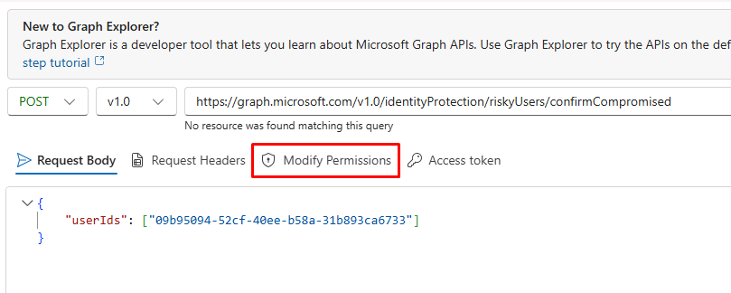

1. On the line for **IdentityRiskyUser.ReadWrite.All**, select **Consent**.

	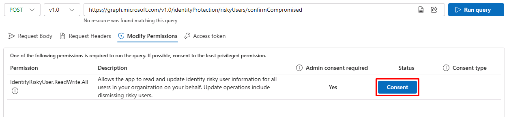

1. In the permissions dialog, select **Accept**.

1. To the right of the **URL**, select **Run query**.

1. Confirm the response shows **No Content - 204** below the permissions body, indicating the action succeeded.

	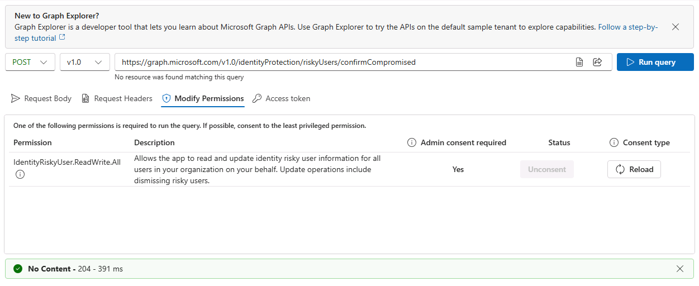

	{: .warning }
	> If you receive an error, verify Adele's **Object ID** is set in the **Request Body** tab.

1. Switch back to your Microsoft Entra admin center tab.

1. In the leftmost pane, go to **ID Protection** > **Risky users**.

1. Move to the bottom of the page and verify **Adele Vance** appears in the table. Observe the results. 

	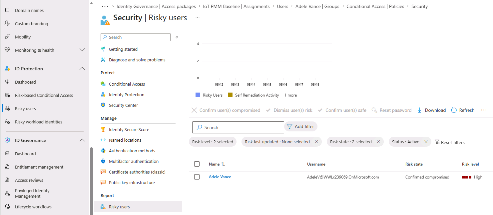

	{: .warning }
	> It may take a few minutes for her account to appear. Periodically refresh the page.

1. In the **Security** page's menu, under **Report**, select **Risk detections**.

1. Select the date under the **Detection time** column and observe the results in the flyout pane.

	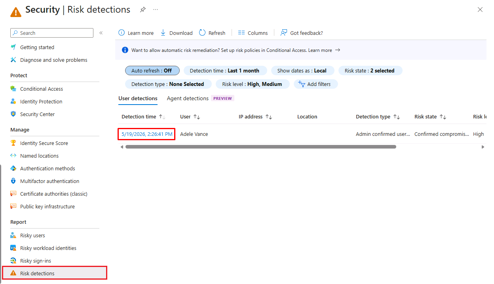

---

#### 04: Revoke Adele's sessions

When an account is suspected to be compromised, an admin like the SOC Analyst can immediately invalidate all of the user's active refresh tokens using the **Revoke sessions** action. 

1. In the leftmost pane, go to **Entra ID** > **Users**.

1. Select **Adele Vance**.

1. On the top bar, select **Revoke sessions**.

	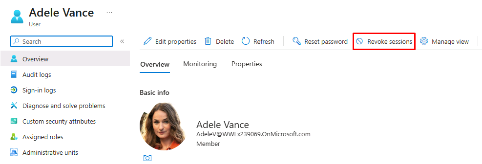

1. In the confirmation dialog, select **Yes**.

1. Switch back to your **Google Chrome** window where Adele is signed in.

1. Open a new tab, then go to `myapps.microsoft.com`.

1. Observe Adele is redirected back to the sign-in page immediately upon the admin's revocation.

1. Sign back in with Adele's credentials:

	| Item     | Value                                                |
	|:---------|:---------|
	| Username | `AdeleV@@lab.CloudCredential(WWLM365Enterprise2019wSPE_EStakeholderKimFrank).TenantName` |
	| Password | `rag-sim6` |

	{: .important }
	> **Continuous Access Evaluation (CAE)** propagates Entra ID's revocation event to CAE-capable resource providers like Exchange Online, SharePoint, Teams, and Microsoft Graph in near real-time.

---

#### 05: Verify CA01 fired on Adele's sign-in

1. Switch back to your **Microsoft Edge** window.

1. In the leftmost pane, go to **Entra ID** > **Monitoring & health** > **Sign-in logs**.

	{: .warning }
	> You'll need to wait around five minutes for Adele's latest sign-in. Periodically select **Refresh** above the table.

1. Select the latest successful sign-in **Date** for **adelev@@lab.CloudCredential(WWLM365Enterprise2019wSPE_EStakeholderKimFrank).TenantName**.

	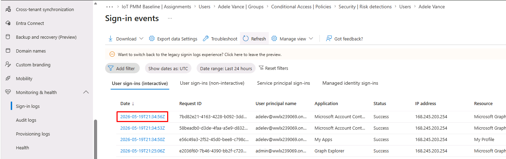

1. At the top of the flyout pane, select the **Conditional access** tab.

1. Observe the **CA01 - Require MFA for high user risk** policy was triggered and shows **Success**.

	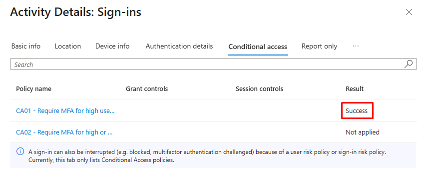

---

#### 06: Dismiss residual risk

1. In the leftmost pane, go to **ID Protection** > **Risky users**.

1. Move to the bottom table, then select **Adele Vance**.

	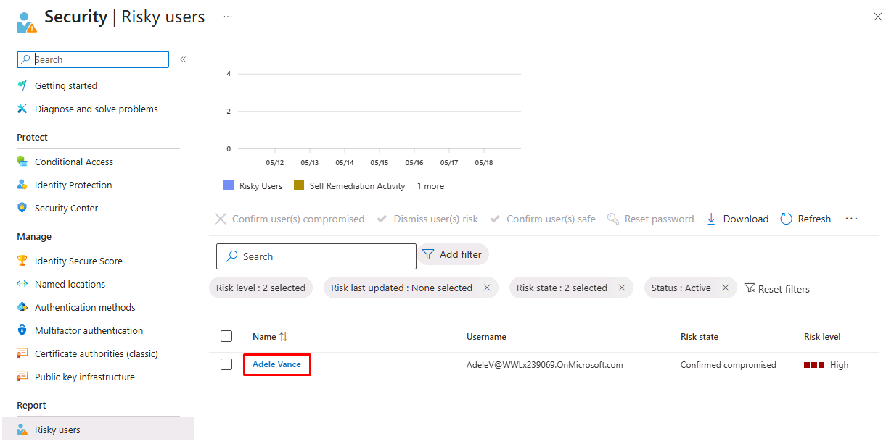

1. Observe Adele's **Risk Level**, and the **Timeline** tile.

1. On the top bar, select **Confirm user(s) safe**.

	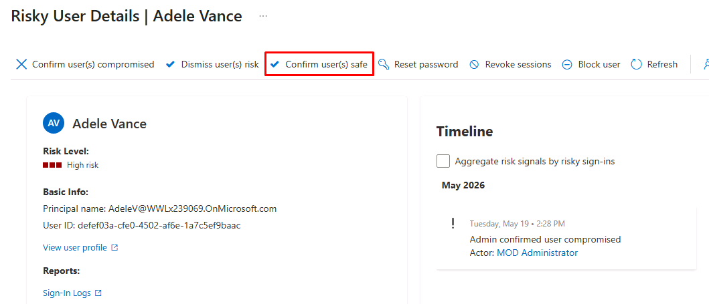

1. In the dialog, select **Yes**.

	{: .note }
	> After a few minutes Adele's risk state will be reset to **None**. You can proceed to the next task without waiting.

---

Adele's group memberships now follow her department attribute through an access package, a mover workflow cleans up her old access automatically, and a quarterly ML-assisted review keeps the resulting membership honest over time. 

On the response side, two risk-based Conditional Access policies and CAE-driven session revocation give admins a real-time control plane for compromised accounts. The same policy engine governs both, with one audit trail across Entra ID, ID Protection, and Lifecycle Workflows.