## Task 01: Broker on-prem access through Private Access

### Introduction
Identity-based network access replaces traditional network perimeter controls. Applications are exposed securely through identity rather than network location.

### Description
You configure Private Access, enabling secure connectivity to an on-prem application without exposing it to the internet.
GSA Private Access replaces traditional VPNs with per-app Zero Trust Network Access. You'll configure three parts:
- **Private Access connector** - runs on a Windows server inside the private network and connects outbound to GSA with no inbound firewall ports.
- **Application segment** - defines what's exposed (FQDN/IP, port, protocol).
- **Enterprise application** - the Entra ID identity representation of the on-prem app, which you can then target with Conditional Access and user assignments.

### Example scenario
You're Adele, needing access to Zava's internal finance system. Instead of launching a VPN, you simply open your browser-and your identity is used to securely broker access to the application.

### Success criteria
- Private Access configured
- App published securely
- Adele assigned access

### Learning resources
- Global Secure Access overview

---

### Key steps

#### 01: Test connection to the on-prem application

1. Switch to the **@lab.VirtualMachine(GSA).SelectLink** VM.

1. Open Microsoft Edge.

1. In the dialog, select **Confirm and continue**.

1. Select **Continue without Google data**.

1. If prompted to sign in, use Adele's credentials:

    | Item | Value |
    |---|---|
    | Email | `AdeleV@@lab.CloudCredential(WWLM365Enterprise2019wSPE_EStakeholderKimFrank).TenantName` |
    | Password | `rag-sim6` |

1. In the address bar, go to `pim.zava.internal`.

1. Observe the page fails to load.

	{: .note }
	> **pim.zava.internal** is an on-prem-only FQDN. No public DNS resolves it, and no traffic from this workstation reaches the on-prem server hosting it. This is the everyday state of every on-prem app inside Zava's corporate network.

1. Select the **Start** menu, then select **Adele Vance** > **Sign out**.

	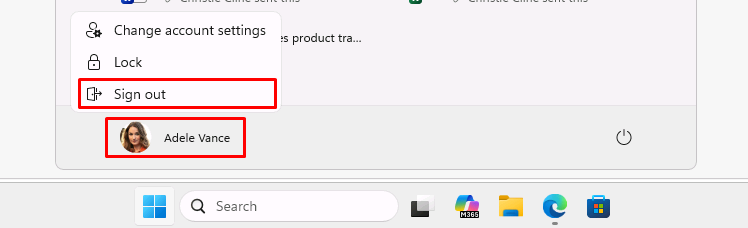

---

#### 02: Install the Private Access connector on the on-premises server

The Private Access connector is the on-prem half of the brokered connection. You'll install it on the **Windows Server 2025** VM, which represents Zava's on-premises data center hosting the Zava Finance Portal application.

{: .note }
> The server has been pre-configured to act as the on-prem host for the Zava Finance Portal:
>
> - **IIS** runs a site named **ZavaPIM** located at `C:\inetpub\zavapim`. The site hosts a small static web app.
> - The IIS binding is **pim.zava.internal** on port 80.
> - A **hosts** file entry on the server (**127.0.0.1 pim.zava.internal**) lets local IIS resolve its own FQDN.

1. Switch to the **@lab.VirtualMachine(WindowsServer2025).SelectLink** virtual machine.

1. Sign in with the following credentials:

    | Item     | Value                                                |
    |:---------|:---------|
    | Username | **@lab.VirtualMachine(WindowsServer2025).Username**       |
    | Password | **@lab.VirtualMachine(WindowsServer2025).Password** |

1. On the desktop, open **MicrosoftEntraPrivateNetworkConnectorInstaller**.

	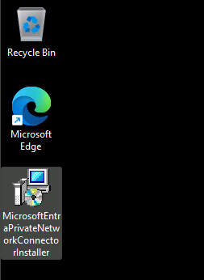

1. Accept the license terms, then select **Install**.

1. When prompted, sign in with your lab's admin credentials to connect it to your tenant:

    | Item     | Value                                                |
    |:---------|:---------|
    | Username | `@lab.CloudCredential(WWLM365Enterprise2019wSPE_EStakeholderKimFrank).AdministrativeUsername` |
    | Password | `@lab.CloudCredential(WWLM365Enterprise2019wSPE_EStakeholderKimFrank).AdministrativePassword` |

1. After setup, select **Close**.

	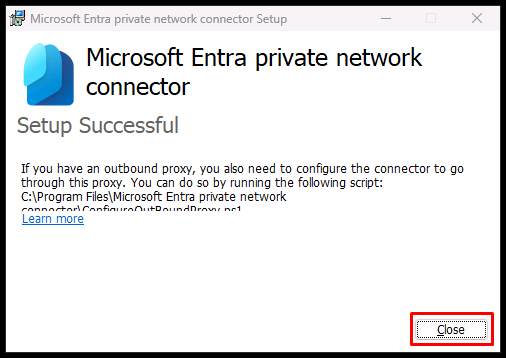

1. Switch back to the **@lab.VirtualMachine(Windows11).SelectLink** virtual machine.

1. In Entra's leftmost pane, go to **Global Secure Access** > **Connect** > **Connectors and sensors**.

1. In the top banner, select **Activate**.

	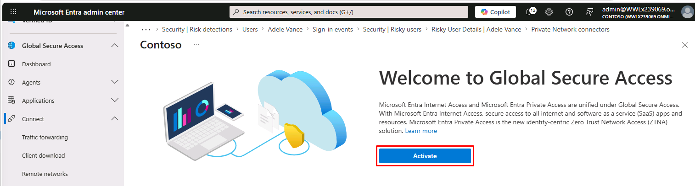

1. Once activated, in the leftmost pane, go to **Global Secure Access** > **Connect** > **Connectors and sensors**.

	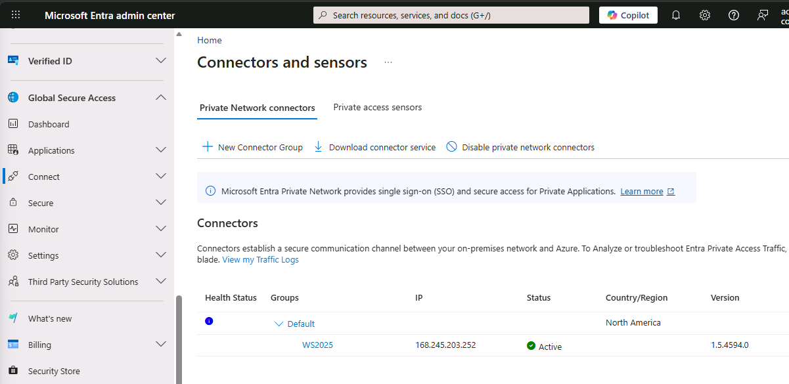

    {: .note }
    > The connector's **Status** should show **Active**. The connector is automatically added to the **Default** connector group.

---

#### 03: Enable Private Access traffic forwarding

Traffic forwarding profiles control which categories of traffic the Global Secure Access client routes through GSA. Three profiles exist: **Microsoft traffic**, **Private access**, and **Internet access**, which can be enabled independently. 

1. In the leftmost pane, go to **Global Secure Access** > **Connect** > **Traffic forwarding**.

1. Turn on **Private access profile**.

1. In the dialog, select **OK**.

    {: .note }
    > Devices with the Global Secure Access client installed will pick up the updated forwarding profile within a few minutes. 

1. In the **Private access profile** tile, under **User and group assignments**, select **View**.

	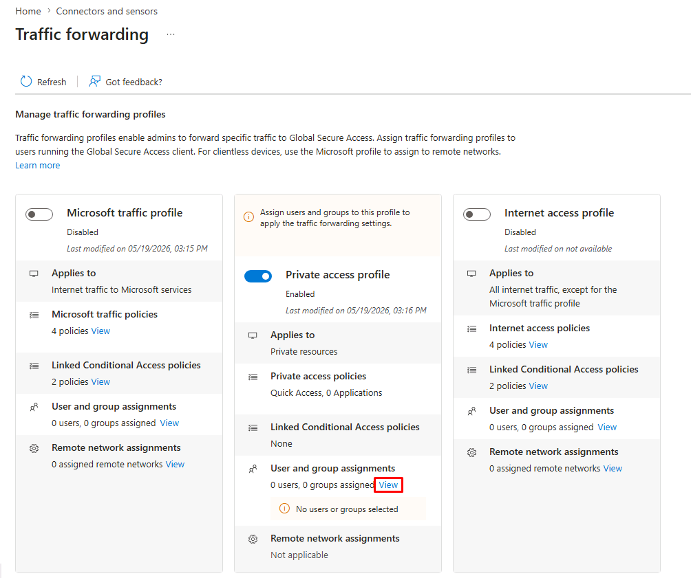

1. In the flyout pane:

	1. Enable **Assign to all users**.

    1. In the dialog, select **OK**.

    	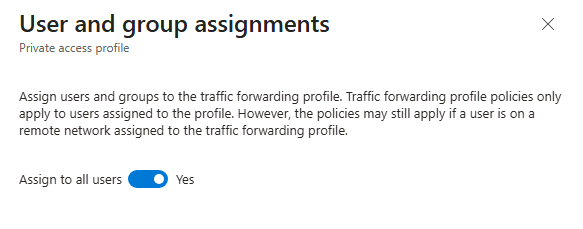

		{: .important }
		> In production, you could add a security group representing your phased GSA rollout.

    1. At the bottom of the pane, select **Done**.

	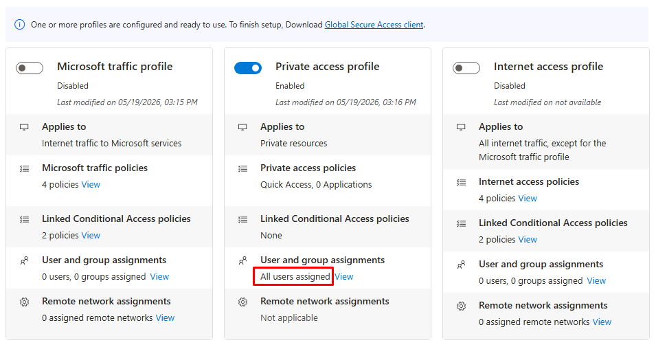

---

#### 04: Create the Zava Finance Portal enterprise application and application segment

Now you'll publish the on-prem Zava Finance Portal site as an enterprise application with an application segment defining its FQDN, port, and protocol.

1. In the leftmost pane, go to **Global Secure Access** > **Applications** > **Enterprise applications**.

1. On the top bar, select **New application**.

	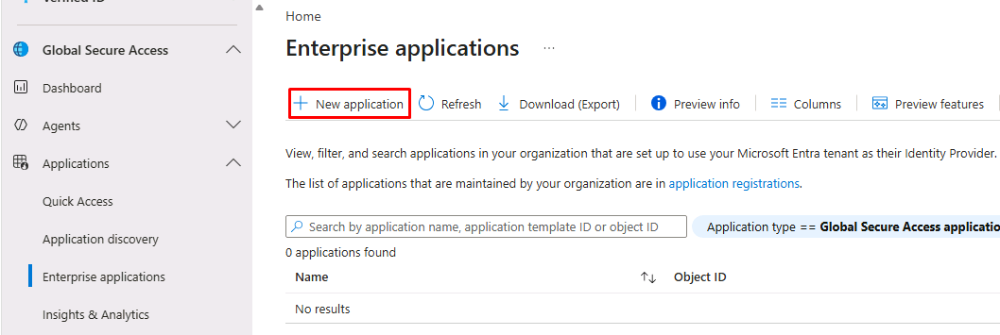

1. Enter the following details:

    | Item | Value |
    |---|---|
    | Name | `Zava Finance Portal` |
    | Connector group | **Default - North America** |

	{: .note }
	> The default connector group contains the connector you registered from **Windows Server 2025**.

1. Under the **Application segment** section, select **Add application segment**.

	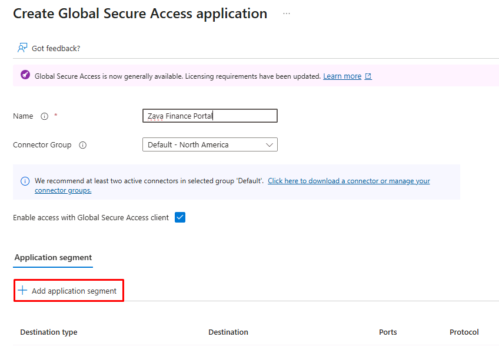

1. In the flyout pane, enter the following details:

    | Item | Value |
    |---|---|
    | Destination type | **Fully qualified domain name** |
    | Fully qualified domain name | `pim.zava.internal` |
    | Ports | `80` |
    | Protocol | **TCP** |

    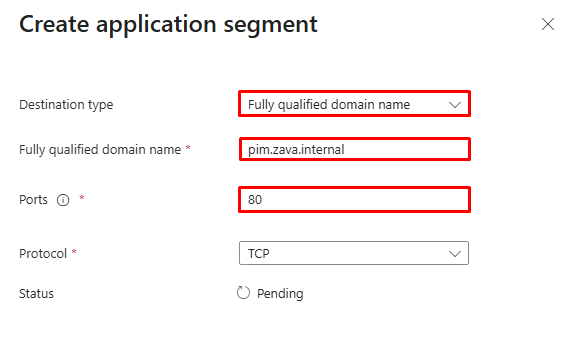

	{: .note }
	> The FQDN must match what end users will type in their browser. The connector on **Windows Server 2025** resolves this FQDN locally via its **hosts** file and relays the request to the IIS site running there. 
	
	{: .important }
	> The GSA service handles DNS resolution for the client side, so end users don't need a **hosts** file entry or DNS reachability on their own device.

1. At the bottom of the pane, select **Apply**.

1. At the bottom of the page, select **Save**.

	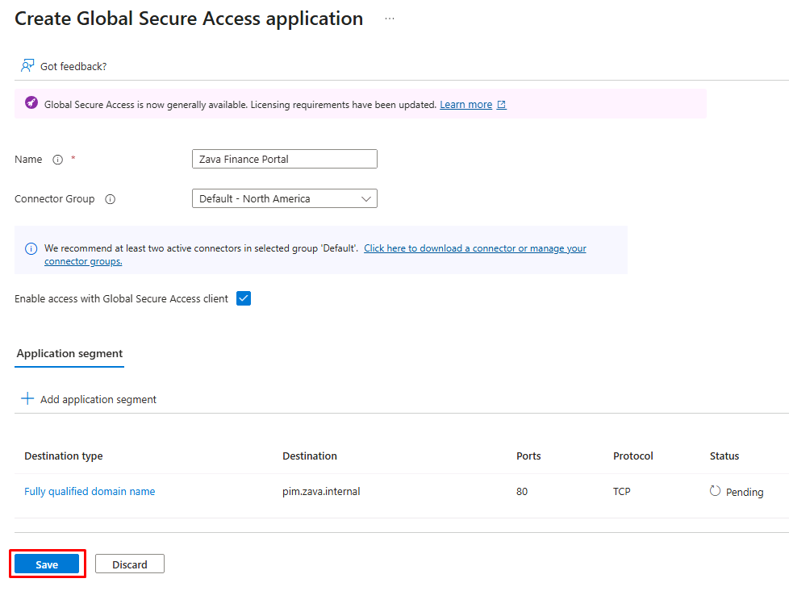

1. Once finished, in the leftmost pane, go back to **Global Secure Access** > **Applications** > **Enterprise applications**.

1. Select the **Zava Finance Portal** application you just created.

	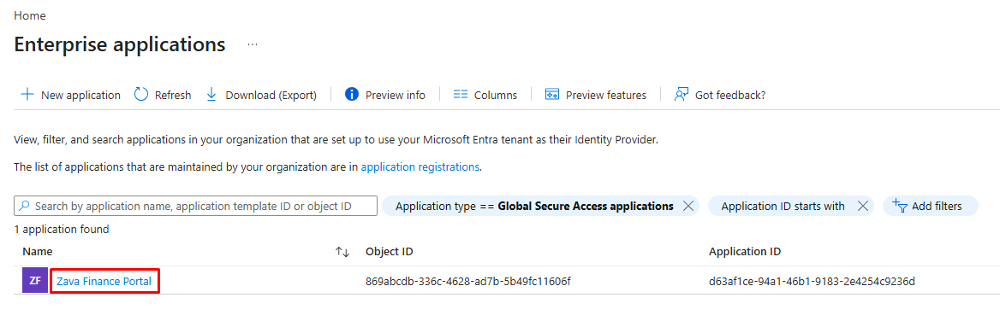

	{: .warning }
	> It may take a minute to appear. Periodically select **Refresh** on the top bar.

1. In the application page's menu, under the **Manage** section, select **Users and groups**.

1. On the top bar, select **Add user/group**.

	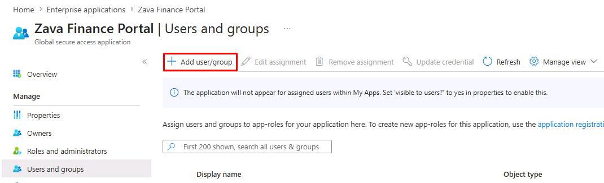

1. Under **Users and groups**, select **None Selected**.

1. In the flyout pane:

    1. In the search box, enter and select `Adele Vance`.

    1. At the bottom of the pane, choose **Select**.

1. At the bottom of the page, select **Assign**.

	{: .important }
	> Assignments to enterprise apps are generally group-based rather than direct assignments. As users join, transfer, or leave a group, their access to an app (like Zava Finance Portal) would then follow their group membership automatically.