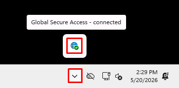
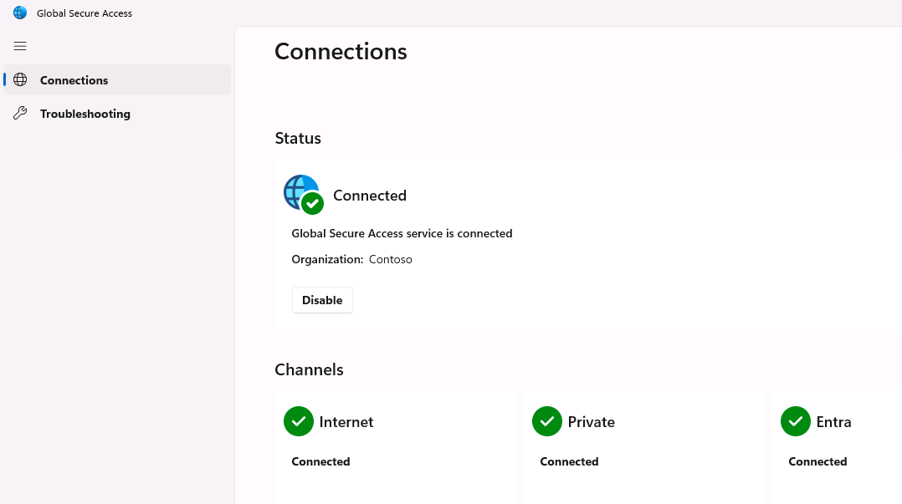
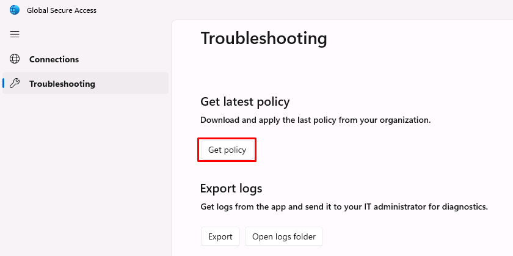
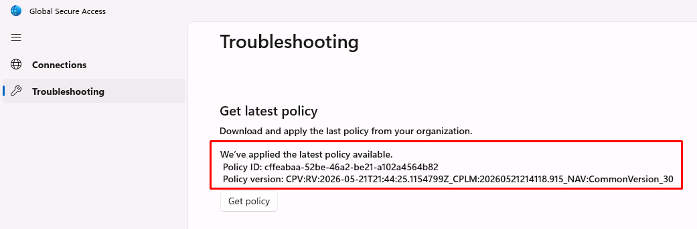
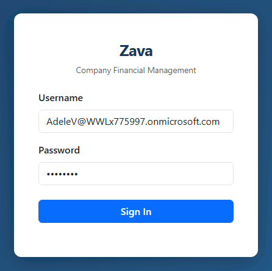
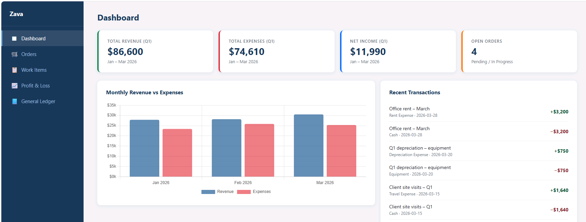
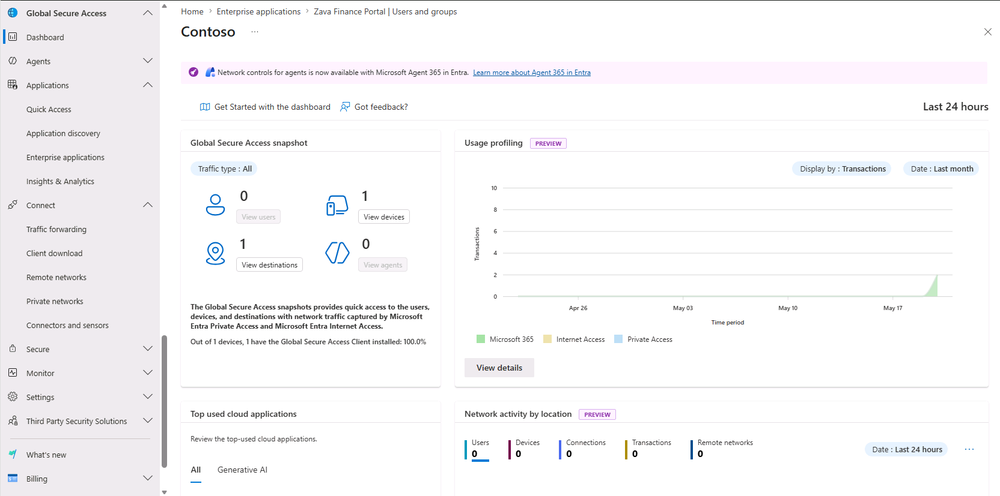
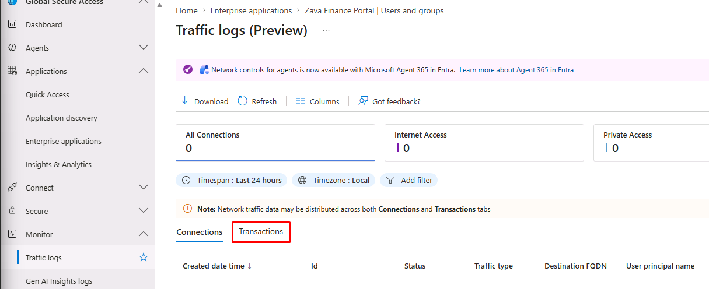
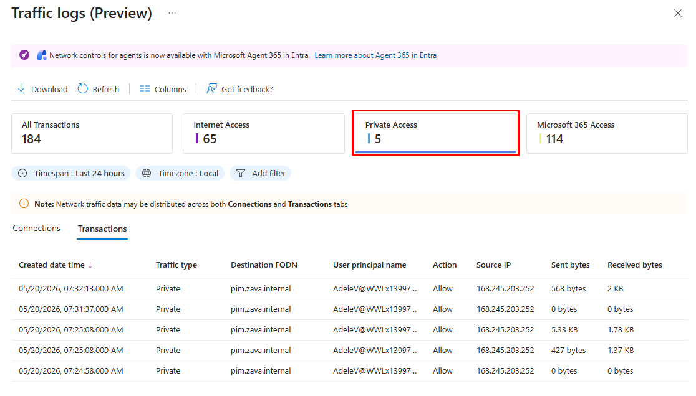
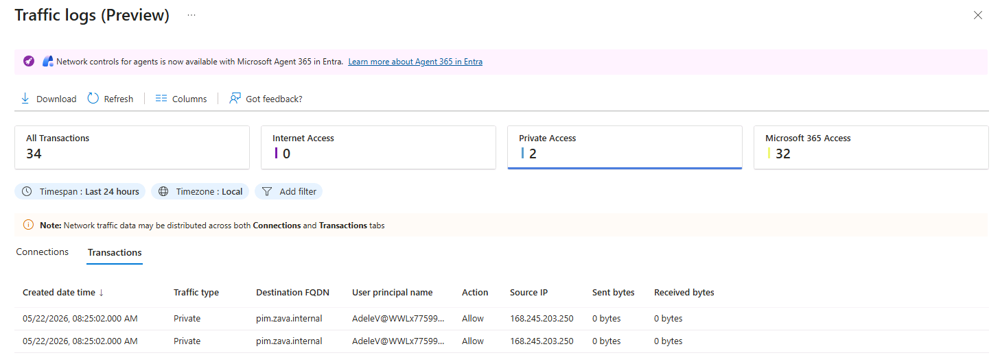

## Task 02: Access the Zava Finance Portal

### Introduction
User access should be seamless when identity is trusted. The system transparently applies policies without adding friction.

### Description
You access the on-prem app as Adele, validating that your identity and device are sufficient to gain access without VPN.
The Global Secure Access client must run on a Microsoft Entra-joined or hybrid-joined device, signed in with a Microsoft Entra account.

### Example scenario
You're Adele, retrieving pricing data. You simply open the application link, and it loads-securely and directly-without any network complexity.

### Success criteria
- App accessible via browser
- No VPN required
- Identity-based access enforced

### Learning resources
- Zero Trust network access

---

### Key steps

#### 01: Verify connection to the Global Secure Access client

The GSA client has been pre-installed on the **GSA** VM. It runs as a Windows service and signs in as the user signed in to the device. It then applies the traffic forwarding profiles configured on the tenant.

1. Switch to the **@lab.VirtualMachine(GSA).SelectLink** virtual machine.

1. In the lower-left corner of the screen, select **Other user**.

1. Sign in with Adele's Entra credentials:

    | Item | Value |
    |:---------|:---------|
    | Username | AdeleV@@lab.CloudCredential(WWLM365Enterprise2019wSPE_EStakeholderKimFrank).TenantName |
    | Password | rag-sim6 |

1. In the lower-right corner of the screen, expand the system tray, then select the **Global Secure Access** icon.

	

1. The **Status** should show **Connected**.

	

	{: .warning }
	> If it shows **Disabled by your organization**:
	>
	> 1. In the leftmost pane, select **Troubleshooting**.
	>
	> 1. Under **Get latest policy**, select **Get policy**.
	>
	>    
	>    
	>
	>	 If you receive a **No policy** message, wait a few minutes, then try again.
    >
	> 1. In the leftmost pane, go back to **Connections**.

1. To ensure you have the latest policies, in the leftmost pane, select **Troubleshooting**.

1. Under **Get latest policy**, select **Get policy**.

	
	

---

#### 02: Access the Zava Finance Portal through Private Access

1. Open **Microsoft Edge**, then go to `pim.zava.internal`.

	{: .warning }
	> If the site fails to load, wait a few minutes for the policy to finish applying and try again.

	{: .important }
	> The Global Secure Access client intercepts the request, brokers it through GSA, and the connector on **Windows Server 2025** relays it to the on-prem IIS site it hosts. 

1. Enter the following credentials:

    | Item | Value |
    |---|---|
    | Email | `AdeleV@@lab.CloudCredential(WWLM365Enterprise2019wSPE_EStakeholderKimFrank).TenantName` |
    | Password | `rag-sim6` |

	

1. Select a few menu items in the leftmost pane to generate more traffic.

	

---

#### 03: View the GSA dashboard

The GSA dashboard provides visualizations of the network traffic that the Microsoft Entra Private Access and Microsoft Entra Internet Access services acquire. 

1. Switch back to the **@lab.VirtualMachine(Windows11).SelectLink** virtual machine.

1. In the leftmost pane, go to **Global Secure Access** > **Dashboard**.

1. Observe the widgets the dashboard provides.

	

	{: .important }
	> For more details on specific tiles, visit the following:
	> - [Global Secure Access snapshot](https://learn.microsoft.com/en-us/entra/global-secure-access/concept-traffic-dashboard#global-secure-access-snapshot)
	> - [Usage profiling](https://learn.microsoft.com/en-us/entra/global-secure-access/concept-traffic-dashboard#global-secure-access-snapshot)
	> - [Top used cloud applications](https://learn.microsoft.com/en-us/entra/global-secure-access/concept-traffic-dashboard#global-secure-access-snapshot)
	> - [Network activity by location](https://learn.microsoft.com/en-us/entra/global-secure-access/concept-traffic-dashboard#global-secure-access-snapshot)
	> - [Cloud applications status](https://learn.microsoft.com/en-us/entra/global-secure-access/concept-traffic-dashboard#global-secure-access-snapshot)
	> - [Web category filtering](https://learn.microsoft.com/en-us/entra/global-secure-access/concept-traffic-dashboard#global-secure-access-snapshot)
	> - [Top used destinations](https://learn.microsoft.com/en-us/entra/global-secure-access/concept-traffic-dashboard#global-secure-access-snapshot)
	> - [External tenant access](https://learn.microsoft.com/en-us/entra/global-secure-access/concept-traffic-dashboard#global-secure-access-snapshot)
	> - [Device status](https://learn.microsoft.com/en-us/entra/global-secure-access/concept-traffic-dashboard#global-secure-access-snapshot)
	> - [Alerts](https://learn.microsoft.com/en-us/entra/global-secure-access/concept-traffic-dashboard#global-secure-access-snapshot)
	> - [Alerts and notifications](https://learn.microsoft.com/en-us/entra/global-secure-access/concept-traffic-dashboard#global-secure-access-snapshot)

---

#### 04: Observe Global Secure Access traffic logs

Traffic logs capture every transaction flowing through GSA. SOC and operations teams can use this as the source for who accessed what, from where, when, and with what result.

1. In the leftmost pane, go to **Global Secure Access** > **Monitor** > **Traffic logs**.

1. Above the table, select the **Transactions** tab.

	

1. Below the top bar, select the **Private Access** tile to quickly filter by traffic type.

	

1. Observe Adele's transactions to **pim.zava.internal** in the log table, with the **Traffic type** column showing **Private**.

	

	{: .warning }
	> It may take a couple minutes to appear.

1. On the top bar, select **Columns** to observe the available columns that can be added to the view.

1. Close the flyout pane without making changes.

1. The **Connections** tab will take more time to populate data. You can proceed to the next task.

	{: .important }
	> Traffic logs operate at three conceptual levels: 
	>- **Session** - A user's logical browsing flow.
	>- **Connection** - Source/destination IP, source/destination port, and fully qualified domain name (FQDN).
	>- **Transaction** - A single request/response pair. 
	>
	> Only **Connections** and **Transactions** are surfaced in the UI.
