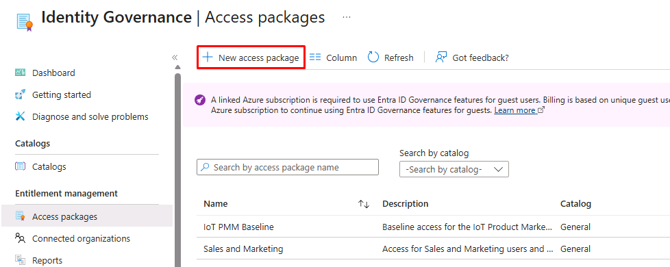
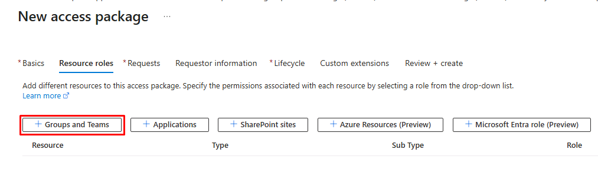
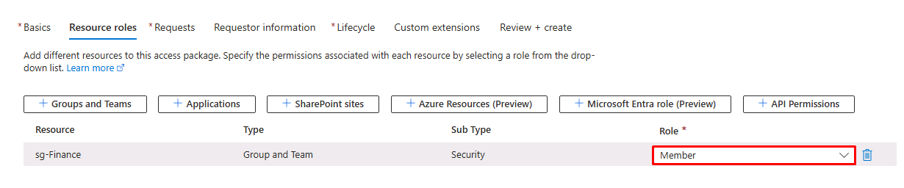
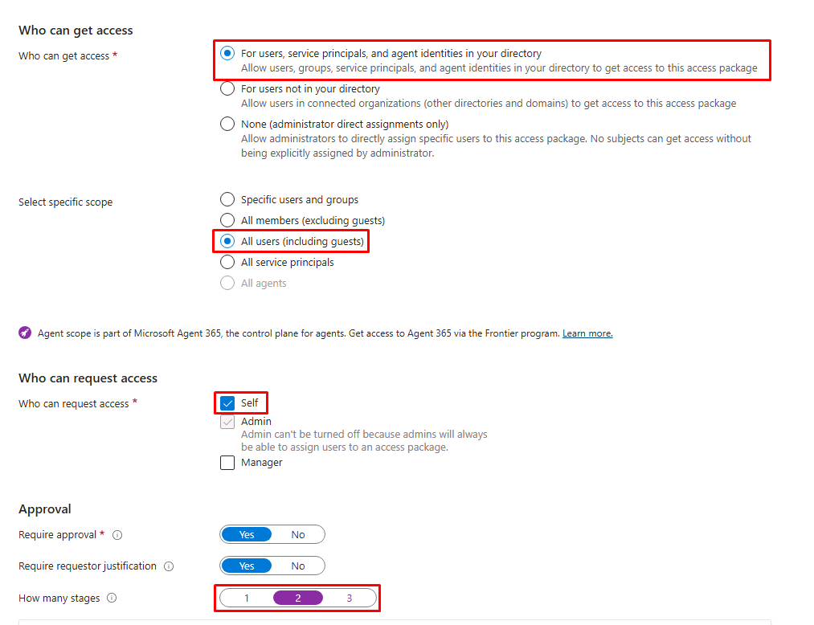
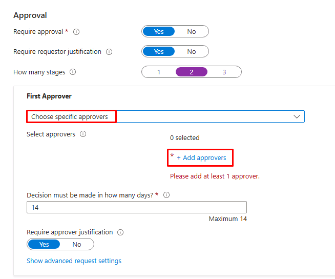
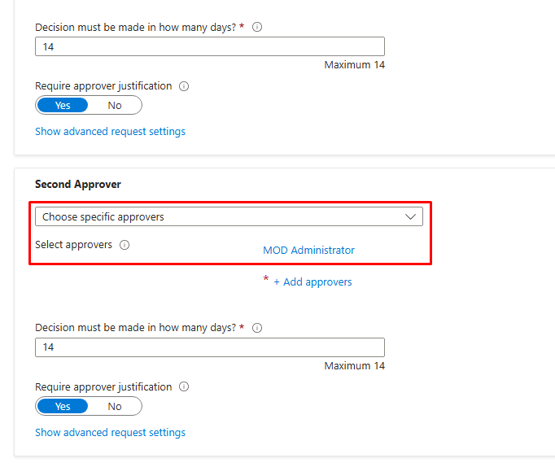
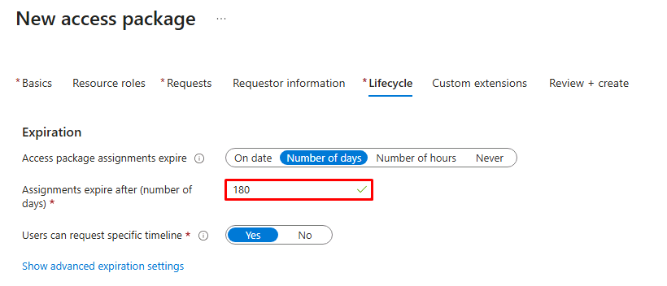
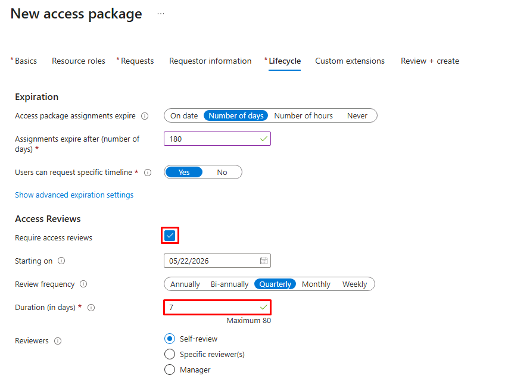
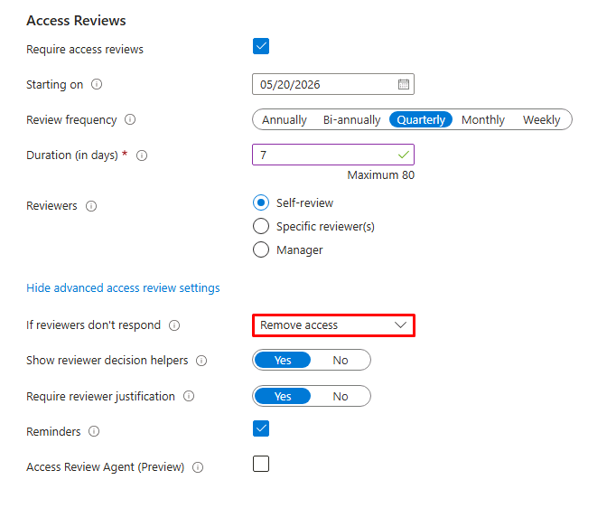

## Task 03: Just-in-time access with multi-stage approval

### Introduction
Sensitive data requires additional controls. Just-in-time access ensures elevated permissions are granted only when needed-and for limited duration.

### Description
You configure a request-based access package with approvals and expiration. Adele must request access and receive approval before accessing sensitive data. You'll configure a sensitive access package that grants access to confidential pricing data with multi-stage approval, time-bound assignment, and a recurring access review.

### Example scenario
You're Adele, preparing a Q4 analysis. You request access to confidential pricing data. Your request is approved in stages, your identity is verified, and access is granted temporarily-just long enough to complete your work.

### Success criteria
- Access request completed
- Approval workflow executed
- Time-bound access granted

### Learning resources
- Access packages and approvals

### Key steps

---

1. In the leftmost pane, go to **ID Governance** > **Entitlement management**.

1. In the page's menu, under **Entitlement management**, select **Access packages**.

1. On the top bar, select **New access package**.

	

1. On the **Basics** tab, enter the following:

    | Item | Value |
    |---|---|
    | Name | `Zava Assistant - Confidential Pricing Data` |
    | Description | `Just-in-time access to Zava Finance's confidential pricing data for marketing analysis. Requires multi-stage approval.` |
    | Catalog | **General** |

1. Select **Next: Resource roles**.

1. On the **Resource roles** tab, select **Groups and Teams**.

	

1. In the flyout pane:

    1. At the top of the pane, select the checkbox for **See all Group and Team(s)...**

    1. In the search box, enter and select `sg-Finance`.

    1. At the bottom of the pane, choose **Select**.

1. In the **Role** column for **sg-Finance**, select the dropdown menu, then select **Member**.

	

1. Select **Next: Requests**.

1. On the **Requests** tab, enter the following:

    | Item | Value |
    |---|---|
    | Who can get access | **For users, service principals and agent...** |
    | Select Specific scope | **All members (excluding guests)** |
    | Who can request access | **Self** |
    | How many stages? | **2** |

	

    {: .important }
    > Unlike the IoT PMM Baseline package in Exercise 01, this package is user-requestable. 

1. Under the **First Approver** section's dropdown menu, select **Choose specific approvers**.

1. Select **Add approvers**.

	

1. In the flyout pane:

	1. Enter and select `@lab.CloudCredential(WWLM365Enterprise2019wSPE_EStakeholderKimFrank).AdministrativeUsername`.

    1. At the bottom of the pane, choose **Select**.

    {: .important }
    > In a real-world environment, the first approver would likely be kept as **Manager as approver**. You'll streamline the process in this exercise just to observe the flow.

1. Under the **Second Approver** section's dropdown menu, keep **Choose specific approvers**.

1. Select **Add approvers**.

1. In the flyout pane:

	1. Enter and select `@lab.CloudCredential(WWLM365Enterprise2019wSPE_EStakeholderKimFrank).AdministrativeUsername`.

    1. At the bottom of the pane, choose **Select**.

	

    {: .important }
    > In a real-world environment, the second approver might be the data owner or anyone responsible for the data being accessed. 

1. Select **Next: Requestor information**.

1. Select **Next: Lifecycle**.

1. On the **Lifecycle** tab, enter the following:

    | Item | Value |
    |---|---|
    | Access package assignments expire | **Number of days** |
    | Assignments expire after | `180` |

	

    {: .note }
    > Adele's access automatically expires after 180 days. If she still needs access, she'd submit a new request to go through the approval flow again.

1. Under **Access Reviews**, select the **Require access reviews** checkbox.

1. Enter the following details:

    | Item | Value |
    |---|---|
    | Starting on | Keep today's date |
    | Review frequency | **Quarterly** |
    | Duration (in days) | `7` |
    | Reviewers | **Self-review** |

	

    {: .important }
    > **Self-review** asks each assignee whether they still need their access. For perpetual baseline packages, **Specific reviewers** (a data owner or manager) may be more appropriate.

1. Select **Show advanced access review settings**.

	{: .warning }
	> You may need to select it twice.

1. Set **If reviewers don't respond** to **Remove access**.

	

    {: .note }
    > If Adele forgets to respond to her own review, her access is automatically removed. Combined with the 180-day expiration, these are two independent mechanisms preventing stale access from persisting.

1. Select **Review + create**.

1. Review the configuration, then select **Create**.