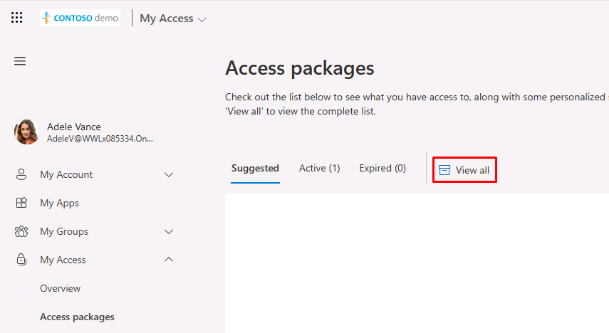
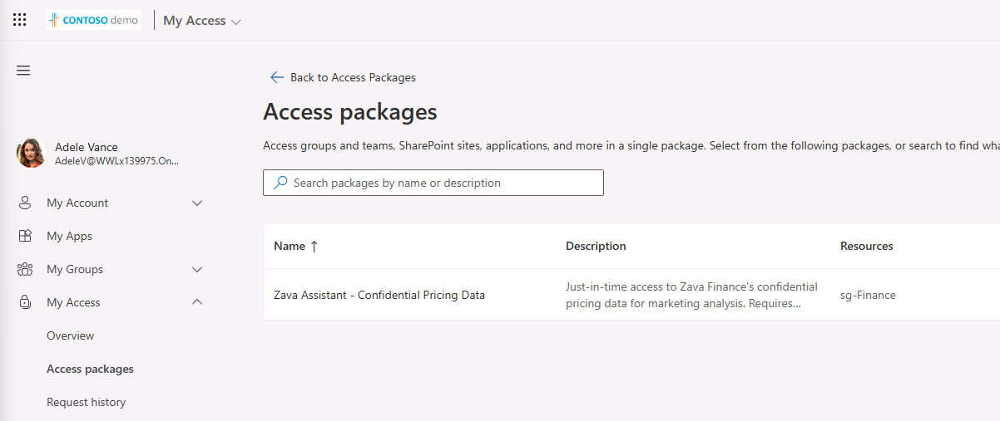
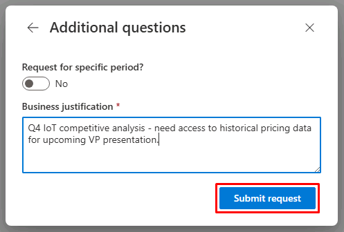
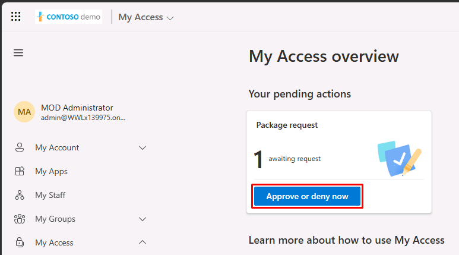
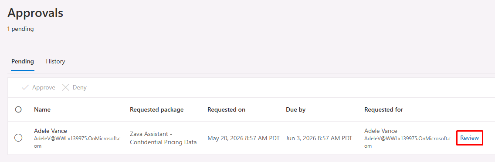
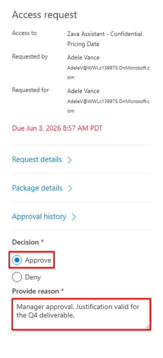
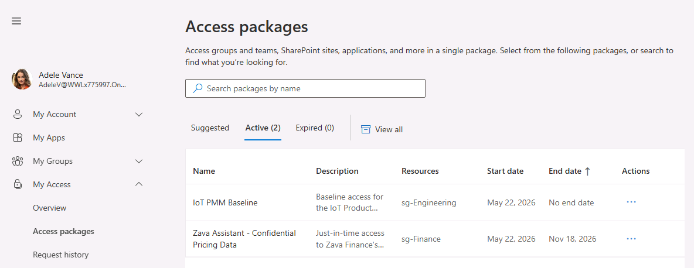

## Task 04: Request and approve access packages

In this task, you'll act as Adele requesting the Zava Assistant access package through the My Access portal, run through the approval process, then confirm her time-bound access is granted.

---

### Key steps

#### 01: Request the Zava Assistant access package

**My Access** is the user-facing portal for access requests in Microsoft Entra ID Governance. Users can browse available access packages, submit requests with justification, and track the status of their requests through approval.

1. Switch to your **Google Chrome** window where Adele is signed in.

1. Open a new tab, then go to `https://myaccess.microsoft.com`.

1. In the leftmost pane, go to **My Access** > **Access packages**.

1. Select **View all**.

	

1. Select **Zava Assistant - Confidential Pricing Data**.

	
	

1. In the dialog:

	1. Select the **Resources** tab to see what you'll be granted.
	
	1. At the bottom of the dialog, select **Continue**.

1. In the **Business justification** box, enter:

    ```
	Q4 IoT competitive analysis - need access to historical pricing data for upcoming VP presentation.
	```

1. Select **Submit request**.

	

---

#### 02: Approve the request through both stages

1. Switch to your Microsoft Edge window signed in with the admin account.

1. Open a new tab, then go to `https://myaccess.microsoft.com`.

    {: .note }
    > The same portal is used by both requesters and approvers.

1. Under **Your pending actions**, select **Approve or deny now**.

	

1. On the line for Adele's request, select **Review**.

	

1. In the flyout pane:

	1. Observe the information.

	1. Select **Request details** to see details like the business justification.

    1. At the top of the pane, select **Review request** to go back.

	1. Under **Decision**, select **Approve**.

    1. Under **Provide reason**, enter the following:

    	```
        Manager approval. Justification valid for the Q4 deliverable.
        ```

		

    1. At the bottom of the pane, select **Submit**.

    	{: .note }
    	> The second stage of approval will then be triggered.

1. Refresh the page to view the second approval request in the list.

1. Repeat the steps for approval, but use the following in the **Provide reason** box:

    ```
	Data owner approval. Access scoped to 180 days per package policy.
	```

---

#### 03: Confirm Adele's time-bound access is granted

1. Switch back to your **Google Chrome** window where Adele is signed in.

1. In the leftmost pane, go to **My Access** > **Access packages**.

1. Select the **Active** tab.

1. Confirm **Zava Assistant - Confidential Pricing Data** appears with an expiration date 180 days from now.

	

	{: .warning }
	> It may take a minute to appear. Refresh the page.