## Task 01: Block confidential file uploads

### Introduction
In this task, you'll route end-user internet traffic through GSA, enable TLS inspection to inspect encrypted web traffic, and create a content policy that blocks risky file uploads to unsanctioned destinations.

### Description
The three pieces work in sequence:
1. **Internet access traffic forwarding** routes the user's web traffic through the GSA cloud service instead of straight out to the internet.
2. **TLS inspection** lets GSA decrypt HTTPS traffic at the service edge so policy engines can see what's inside. Without it, GSA only sees the destination (for example, "user is going to chatgpt.com"), rather than the file or URL path that actually matters for a DLP decision.
3. **Content policies** then inspect the decrypted payload and block or allow it accordingly.

### Example scenario
You're Adele, trying to upload a pricing file to an external AI service. The upload is blocked immediately because the system recognizes the data as confidential-before it ever leaves your environment.

### Success criteria
- TLS inspection enabled
- DLP policy active
- Upload attempts blocked

### Learning resources
- Network DLP in GSA

---

### Key steps

#### 01: Enable the internet access traffic forwarding profile

The internet access profile routes outbound web traffic on ports 80 and 443 through the GSA cloud service.

1. On the **@lab.VirtualMachine(Windows11).SelectLink** virtual machine, switch to your Microsoft Edge window.

1. Switch back to the tab with `entra.microsoft.com` open.

1. In the leftmost pane, go to **Global Secure Access** > **Connect** > **Traffic forwarding**.

1. Turn on **Internet access profile**.

1. In the dialog, select **Enable Microsoft and Internet Access profiles**.

	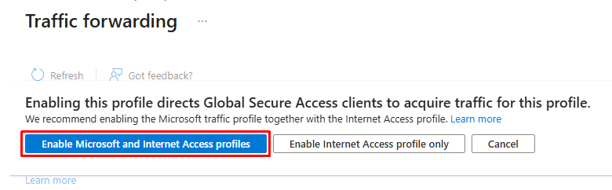

1. In the **Internet access profile** tile, under **User and group assignments**, select **View**.

	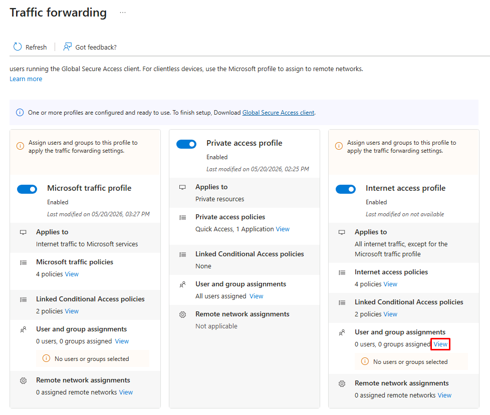

1. In the flyout pane:

	1. Select **Assign to all users**.

	1. In the dialog, select **OK**.

	1. At the bottom of the pane, select **Done**.

---

#### 02: Generate a TLS inspection certificate

Transport Layer Security (TLS) inspection in Microsoft Entra Internet Access lets you decrypt and inspect encrypted traffic at service edge locations. This lets GSA apply advanced security controls like threat detection, granular web content filtering, and other content controls.

{: .important }
> For more information, take a look at the [Key concepts](https://learn.microsoft.com/en-us/entra/global-secure-access/tutorial-internet-access-tls-inspection#key-concepts).

1. In the leftmost pane, go to **Global Secure Access** > **Secure** > **TLS inspection policies**.

1. At the top of the page, select the **TLS inspection settings** tab.

1. On the top bar, select **Create certificate**.

	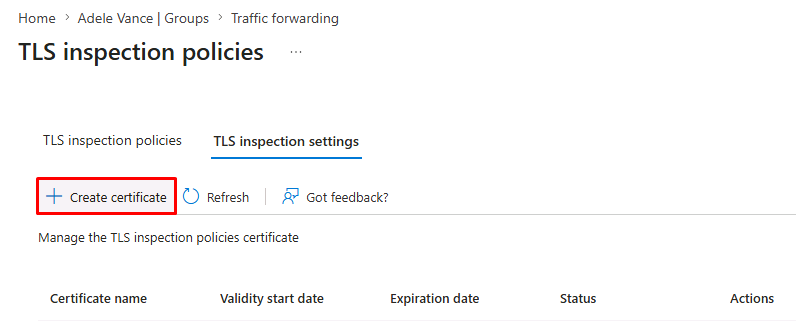

1. In the flyout pane, enter the following:

	| Item | Value |
	|---|---|
	| Certificate name | `zavatls` |
	| Common name | `Zava TLS ICA` |
	| Organizational name | `Zava IT` |

	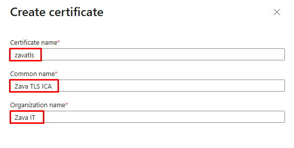

1. At the bottom of the pane, select **Create CSR**.

1. In the **Downloads** dialog, select the folder icon to go directly to the **Downloads** folder.

	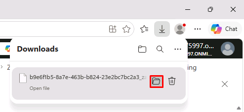

1. Copy the **full** file name including **.csr**, and paste it in the following text box:

    @lab.TextBox(csr)

	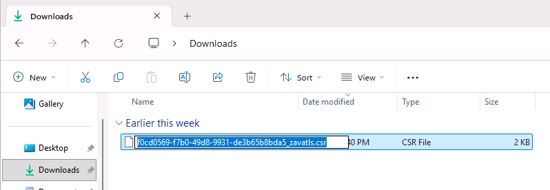

    {: .warning }
    > This value will be referenced again in the next step.

---

#### 03: Sign the CSR using the lab helper script

In production, customers could hand the .csr file to their enterprise PKI team, who would sign it with the corporate root CA. For the lab, a helper script at **C:\Lab Files\signGsaCert.ps1** creates a Zava root CA on the VM and signs the CSR with it.

{: .note }
> **OpenSSL prerequisite**
>
>This step uses **OpenSSL** to sign the certificate request generated by GSA, which has been pre-installed.

1. On the VM's taskbar, right-click the **Start** button, then select **Terminal (Admin)**.

1. In the dialog, select **Yes**.

1. In the terminal, run the following script:

	`& "C:\Lab Files\signGsaCert.ps1" -CSRPath "C:\Users\Admin\Downloads\@lab.Variable(csr)"`

	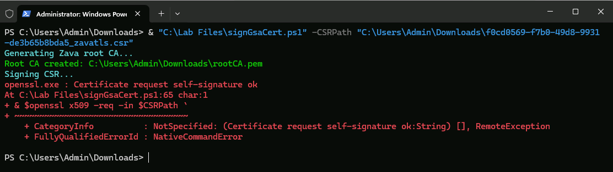

	>[!help] The message in the screenshot in red can be safely ignored. 
	>
	>**openssl.exe : Certificate request self-signature ok** 

	{: .warning }
	> This command uses the file name you pasted in the prior step.

1. Confirm the following files are in your **Downloads** folder:

	- **signedcertificate.pem**
    - **rootCA.pem**

	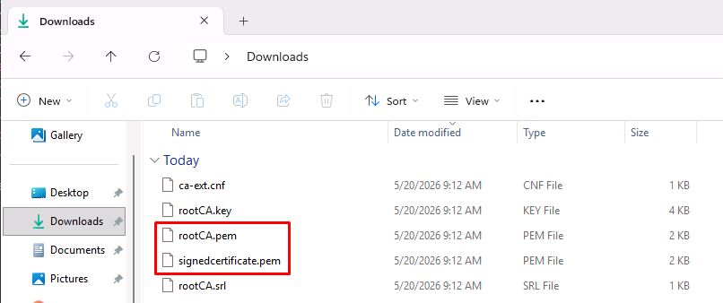

---

#### 04: Upload the signed certificate and chain to GSA

1. Go back to your Microsoft Edge tab with the **TLS inspection settings** page open.

1. On the row for the **zavatls** certificate, under the **Status** column, select **Upload certificate**.

	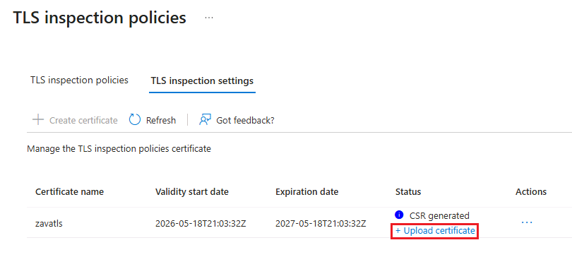

1. In the flyout pane:

    1. Under **Upload certificate**, select **Browse**.
    
    1. Go to **Downloads**, select **signedcertificate.pem**, then select **Open**.

		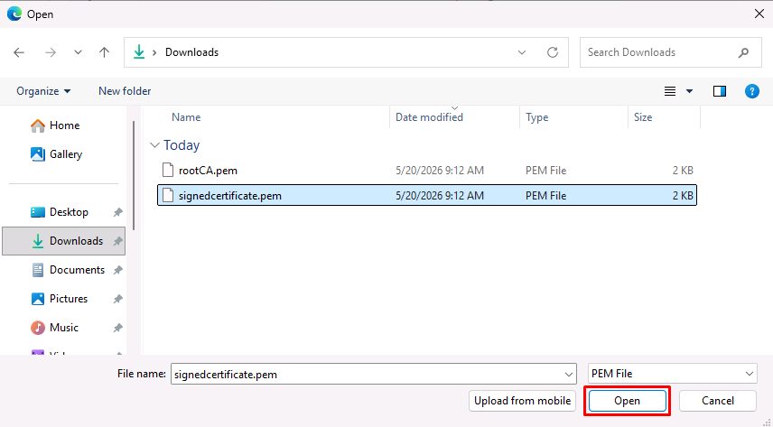

    1. Under **Upload chain**, select **Browse**.
    
    1. In **Downloads**, select **rootCA.pem**, then select **Open**.

    1. At the bottom of the pane, select **Upload signed certificate**.

1. On the row for the **zavatls** certificate, select the ellipsis (**...**), then select **Enable**.

	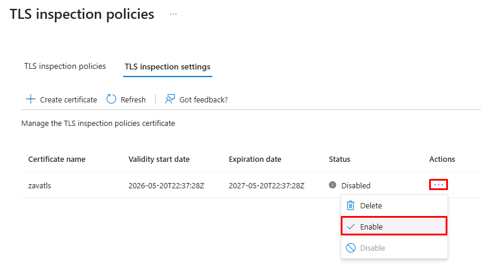

1. Wait until the **Status** changes to **Enabled** before proceeding.

	{: .warning }
	> This may take a couple minutes. Periodically select **Refresh** on the top bar.

---

#### 05: Create a TLS inspection policy

1. At the top of the page, select the **TLS inspection policies** tab.

1. On the top bar, select **Create policy**.

	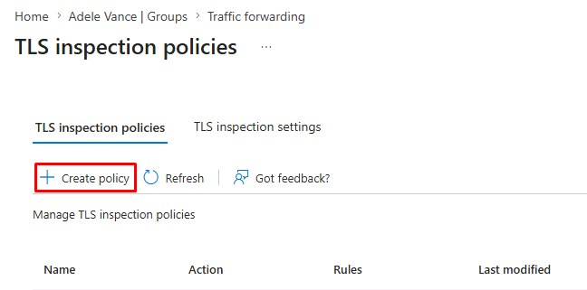

1. On the **Basics** tab, enter the following:

	| Item | Value |
	|---|---|
	| Name | `Zava TLS Inspection Policy` |
	| Description | `Default inspect policy for end-user internet traffic.` |
	| Default action | **Inspect** |

1. At the top of the page, select the **Review** tab.

1. At the bottom of the page, select **Submit**.

---

#### 06: Create a network DLP content policy

With internet access forwarding and TLS inspection in place, GSA can now see the actual content of web traffic. The content policy you'll create will define what content is blocked and where.

1. In the leftmost pane, go to **Global Secure Access** > **Secure** > **Content policies**.

1. On the top bar, select **Create policy**.

	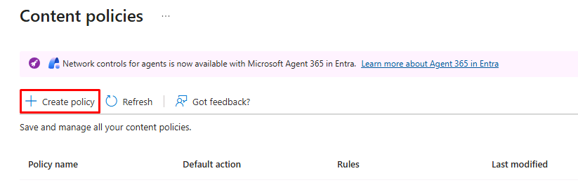

1. On the **Basics** tab, enter the following:

	| Item | Value |
	|---|---|
	| Name | `Block uploads to ChatGPT` |
	| Description | `Blocks specific uploads to ChatGPT from managed devices to prevent shadow AI data exfiltration.` |

1. Select **Next**.

1. On the **Rules** tab, select **Add rule**.

1. On the **Add Content Rule** page, enter the following:

	| Item | Value |
	|---|---|
	| Rule name | `Block uploads to ChatGPT` |
	| Description | `Block rule for Word/PDF file uploads to ChatGPT endpoints.` |
	| Action | **Block** |
	| Activities | **Upload** |
	
	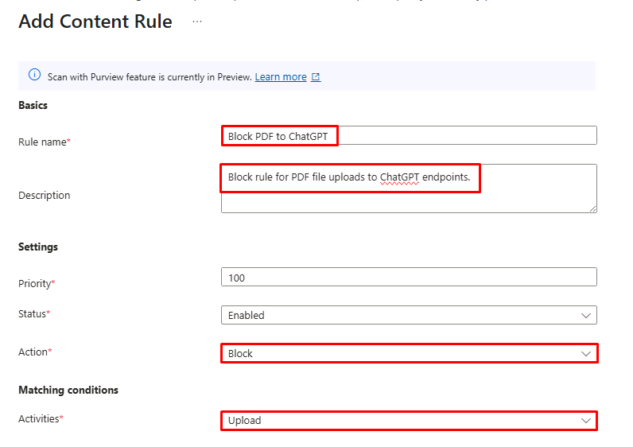

1. Select the **File content types** dropdown menu, then select the following:

	- **Word (97-2003)**
    - **Word Document**
    - **PDF**

	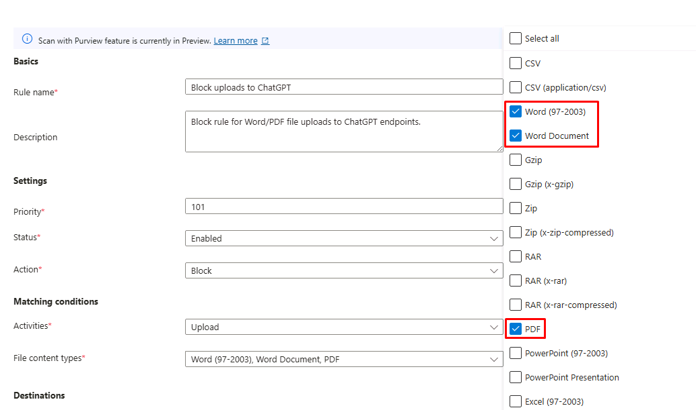

1. Under **Destinations**, select **Add destination** > **URL**.

	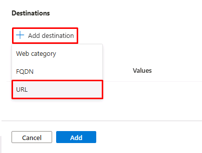

1. In the flyout pane:

    1. Enter `https://chatgpt.com/backend-api/files`, then select **Add URL**.

    1. Enter `https://chatgpt.com/backend-api/files/process_upload_stream`, then select **Add URL**.

		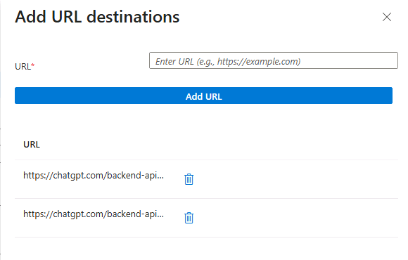

    1. At the bottom of the pane, select **Add**.

1. Under **Destinations**, select **Add destination** > **FQDN**.

	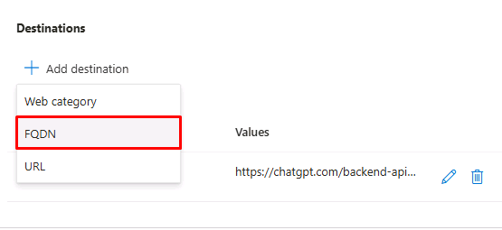

1. In the flyout pane:

    1. Enter `*.oaiusercontent.com`, then select **Add FQDN**.

    1. At the bottom of the pane, select **Add**.

	{: .note }
	> These are the endpoints ChatGPT uses for file upload operations, identified using browser developer tools.

1. At the bottom of the page, select **Add**.

	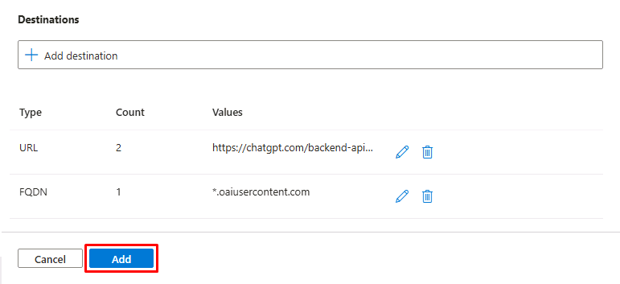

1. Select **Next**.

1. Select **Create**.

---

#### 07: Create the security profile and link the policies

Security profiles group one or more policies together, which you can then apply to user traffic via Conditional Access. You'll create a security profile and link the TLS inspection and content policies to it.

1. In the leftmost pane, go to **Global Secure Access** > **Secure** > **Security profiles**.

1. On the top bar, select **Create profile**.

	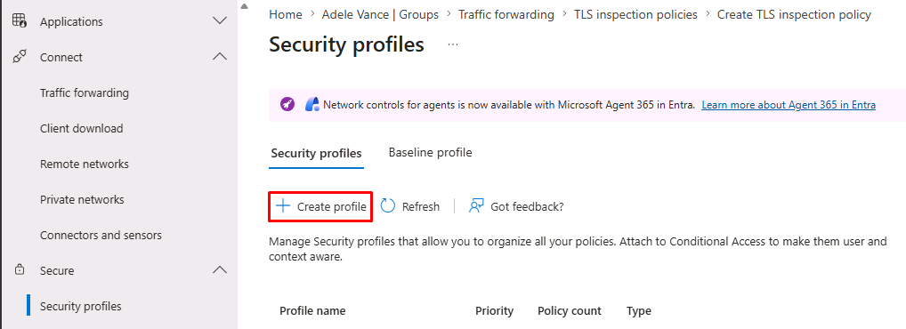

1. On the **Basics** tab, enter the following:

	| Item | Value |
	|---|---|
	| Profile name | `Zava Internet Security` |
	| Description | `End-user internet security profile: TLS inspection, network DLP, prompt injection protection.` |

1. Select **Next**.

1. Select **Link a policy** > **Existing TLS inspection policies**.

	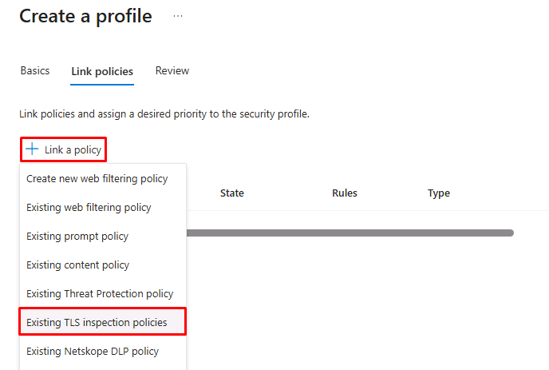

1. In the flyout pane:

	1. For **Policy name**, select **Zava TLS Inspection Policy**.

	1. At the bottom of the pane, select **Add**.

1. Select **Link a policy** > **Existing content policy**.

	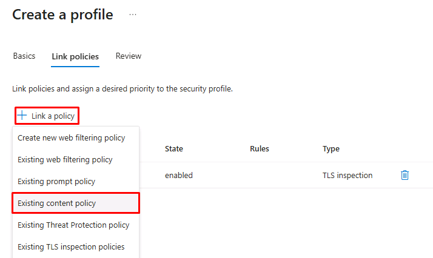

1. In the flyout pane:

	1. From the **Policy name** dropdown menu, select **Block uploads to ChatGPT**.

	1. At the bottom of the pane, select **Add**.

1. Select **Next**.

1. Select **Create a profile**.

	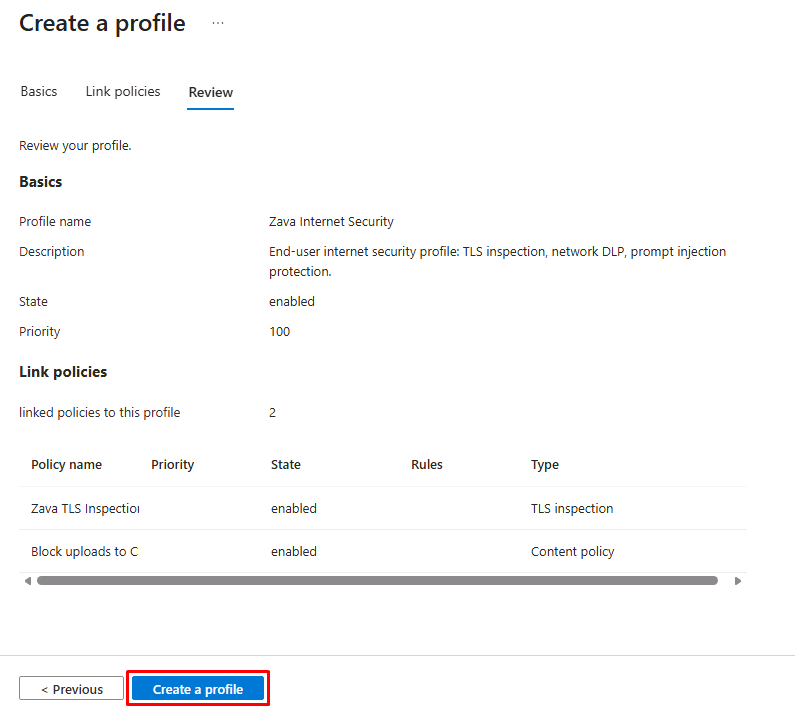

---

#### 08: Assign the security profile via Conditional Access

You'll now tie the security profile to a new Conditional Access policy.

1. In the leftmost pane, go to **Entra ID** > **Conditional Access**.

1. On the top bar, select **Create new policy**.

1. In the **Name** box, enter:

	`CA03 - Zava Internet Security Profile`

1. Under **Users or agents**, select **0 users or agents selected**.

	1. Under **Include**, select **All users**.

		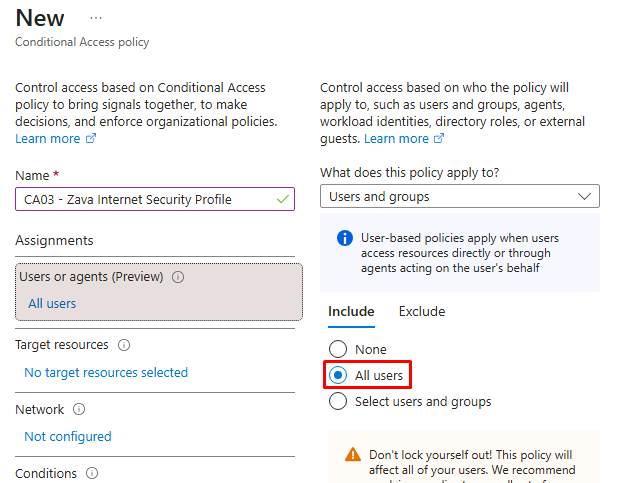

	1. Select the **Exclude** tab.

	1. Select the **Users and groups** checkbox.

	1. Enter and select `@lab.CloudCredential(WWLM365Enterprise2019wSPE_EStakeholderKimFrank).AdministrativeUsername`.

	1. At the bottom of the pane, choose **Select**.

	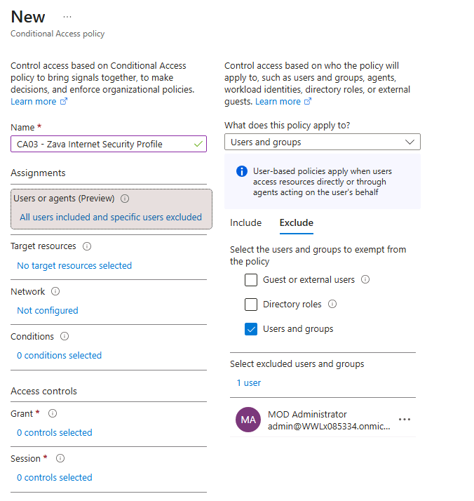

1. Under **Target resources**, select **No target resources selected**.

	1. Under **Include**, select **All internet resources with Global Secure Access**.

		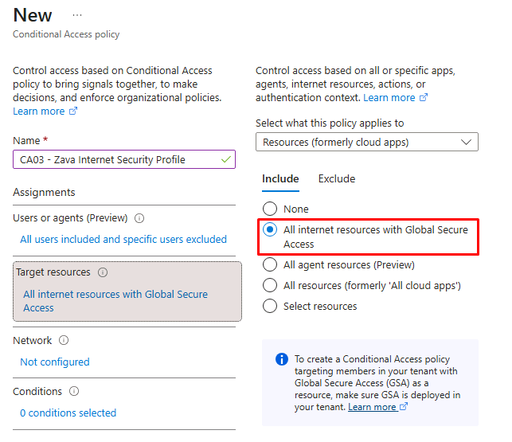

1. Under **Session**, select **0 controls selected**.

	1. In the flyout pane, select **Use Global Secure Access security profile**.

	1. In the dropdown menu, select **Zava Internet Security**.

		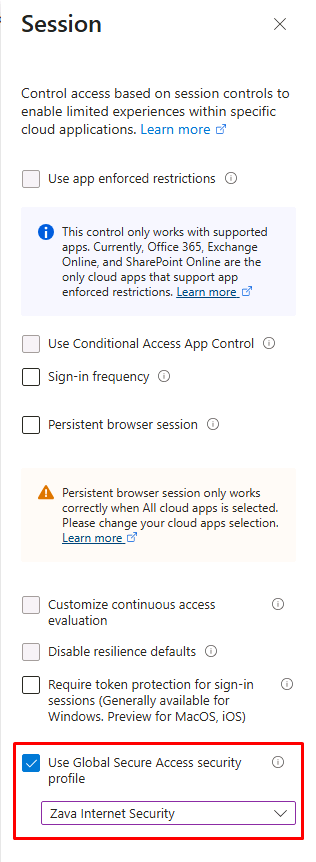

	1. At the bottom of the pane, choose **Select**.

1. Set **Enable policy** to **On**.

	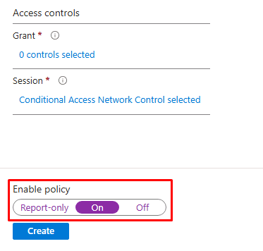

1. At the bottom of the page, select **Create**.
