## Task 02: Govern Copilot Studio agents with GSA
### Introduction
In this task, you'll bring Copilot Studio agent traffic under GSA, then apply a web content filtering policy that governs where those agents can connect.
### Description
Two GSA capabilities address this:
- **MCP traffic logging** gives security teams visibility into what MCP servers agents are calling, which tools those servers expose, and what arguments are passed.
- **Secure Web and AI Gateway for Copilot Studio agents** brings the outbound network traffic of Copilot Studio agents under the same GSA policy engine used for end-user traffic - web content filtering, threat intelligence filtering, content policy, and more.
### Example scenario
You're Adele, relying on internal AI agents. Every action those agents take is monitored and governed, ensuring they only access approved resources.
### Success criteria
- Agent traffic routed through GSA
- Policies applied to AI activity
- Traffic visible to administrators
### Learning resources
- GSA for AI agents

---

### Key steps

#### 01: Learn about Gen AI Insights logs

GSA Model Context Protocol (MCP) logging provides advanced monitoring and analysis capabilities for MCP traffic between client MCP on devices and remote MCP servers. This provides visibility into which MCP servers are being used, what tools and resources they expose, and how those tools are invoked. 

MCP logging helps you discover shadow MCP servers, enforce security and governance controls on AI agent communications, and understand which tools are being exposed and used. It also monitors a client MCP that is used by the Copilot Studio agent and a remote MCP server if you've enabled GSA MCP integration for Copilot Studio agents.

MCP logging uses deep packet inspection to identify MCP traffic based on the protocol itself, rather than a predefined cloud app catalog. This approach enables discovery of previously unknown or private MCP servers that employees might be using.

{: .important }
> For more information, visit [MCP traffic logs](https://learn.microsoft.com/en-us/entra/global-secure-access/how-to-view-model-context-protocol-logging).

---

#### 02: Enable Global Secure Access for Copilot Studio agents

By default, Copilot Studio agents make outbound network calls directly to the internet, bypassing your GSA policies entirely. You'll enable an integration in the Power Platform admin center that routes agent traffic through GSA, bringing every agent connection under the same network security plane as your users.

1. Open a new browser tab, then go to `admin.powerplatform.microsoft.com`.

1. If prompted, select your lab admin account.

1. In the leftmost pane, go to **Security**.

1. In the page's menu, select **Identity & access**.

	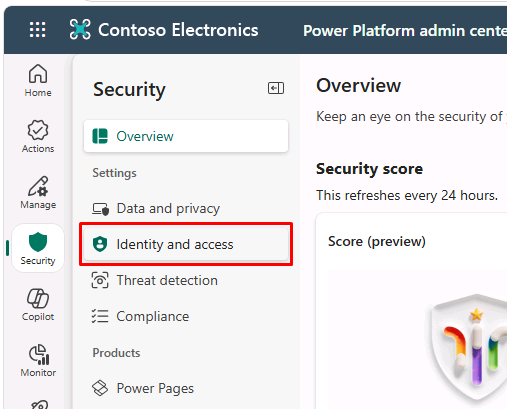

1. Select **Global Secure Access for Agents**.

	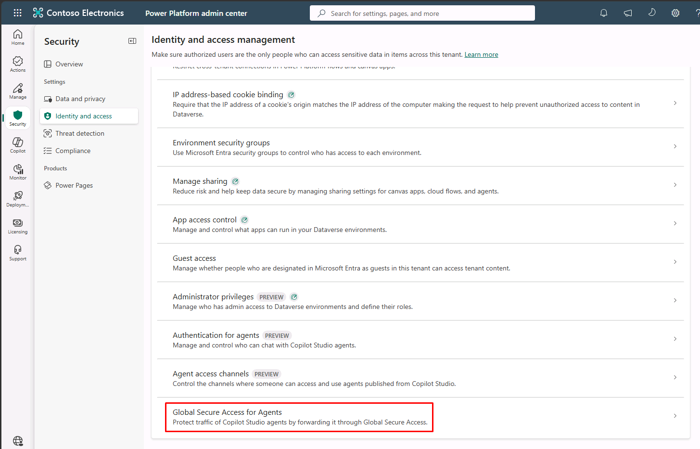

1. In the flyout pane:

	1. Select the pre-deployed **Dev One** environment.

    1. At the bottom of the pane, select **Set up**.

		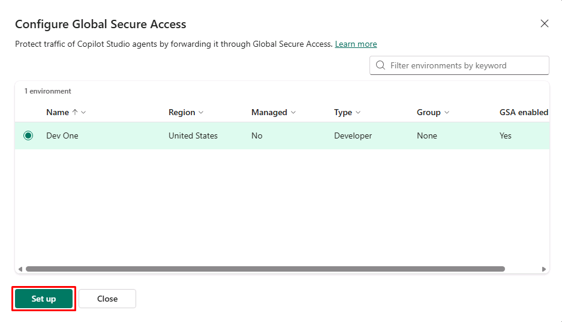

    1. Turn on **Enable Global Secure Access for Agents**.

		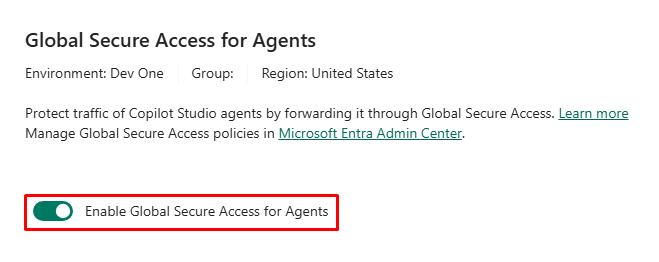

    1. At the bottom of the pane, select **Save**.

	{: .important }
	> After enabling this integration, pre-existing Copilot Studio custom connectors must be edited and saved again before their traffic will route through GSA. Connectors created after the integration is enabled will use it automatically.

---

#### 03: Create a web content filtering policy

You'll start by creating a web content filtering policy that blocks high-risk categories.

1. Switch back to your `entra.microsoft.com` tab.

1. In the leftmost pane, go to **Global Secure Access** > **Secure** > **Web content filtering policies**.

1. On the top bar, select **Create policy**.

	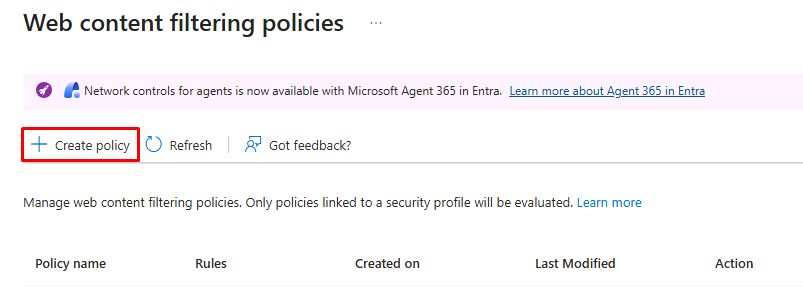

1. On the **Basics** tab, enter the following:

	| Item | Value |
	|---|---|
	| Name | `Zava Agent Web Filtering` |
	| Description | `Blocks high-risk web categories from Copilot Studio agent traffic.` |
	| Action | **Block** |

1. Select **Next**.

1. On the **Policy Rules** tab, select **Add Rule**.

1. In the flyout pane:

	1. Enter the following:

        | Item | Value |
        |---|---|
        | Name | `Block high-risk categories` |
        | Destination type | **webCategory** |

		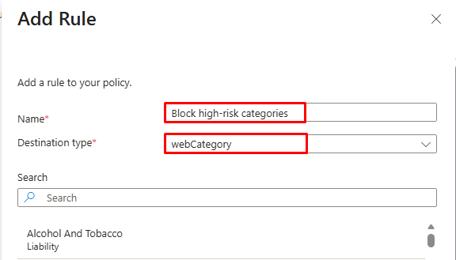

    1. Under **Search**, enter and select the following:

		- `Hacking`
        - `Illegal Software`
        - `Web Repository And Storage`

		{: .important }
		> You can build out the full set of categories appropriate to your organization's risk tolerance and compliance posture for AI agent egress.

    1. At the bottom of the pane, select **Add**.

		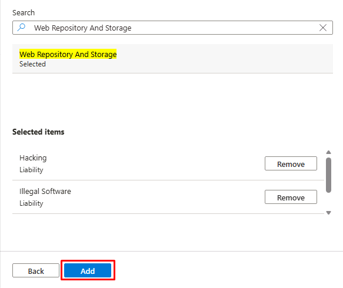

1. Select **Next**.

1. Select **Create policy**.

	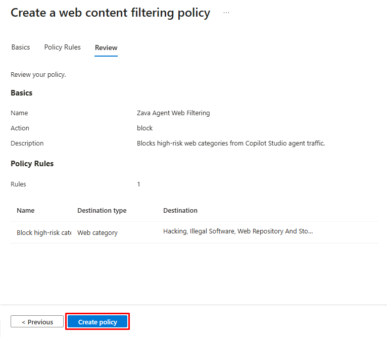

---

#### 04: Apply the web content filtering policy to the baseline profile

Copilot Studio agents make outbound calls without a user sign-in, so Conditional Access policies don't apply. Security policies for agents are instead linked to the baseline profile, which applies tenant-wide to all agent traffic.

1. In the leftmost pane, go to **Global Secure Access** > **Secure** > **Security profiles**.

1. At the top of the page, select the **Baseline profile** tab.

	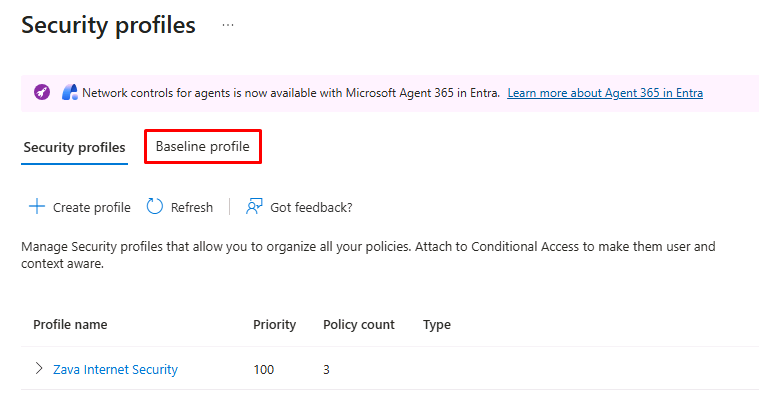

1. Below the tabs, select **Edit profile**.

	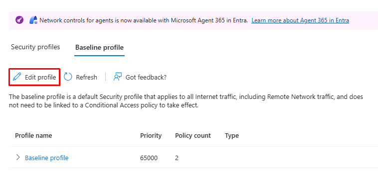

1. In the page's menu, select **Link policies**.

1. Select **Link a policy** > **Existing web filtering policy**.

	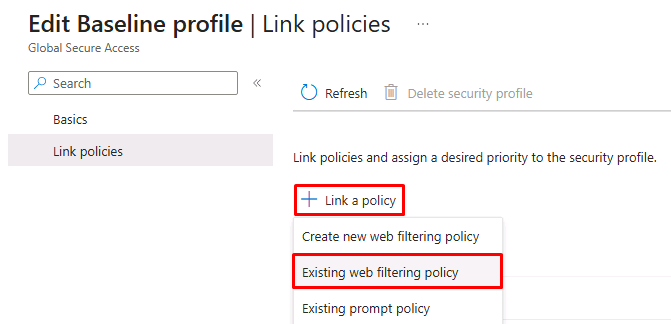

1. In the flyout pane:

	1. For **Policy name**, select **Zava Agent Web Filtering**.

	1. At the bottom of the pane, select **Add**.

	{: .important }
	> Combined with MCP traffic visibility, you have both detection (Gen AI Insights) and enforcement (baseline profile policy) for AI agent egress.
