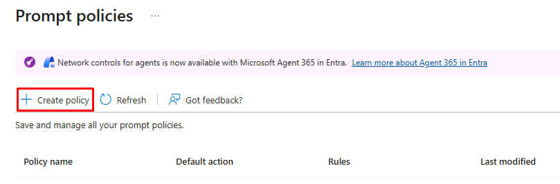
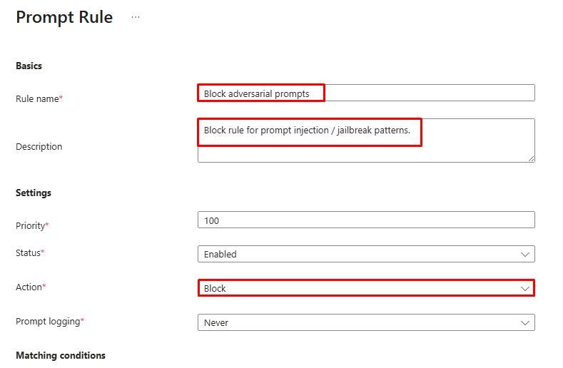
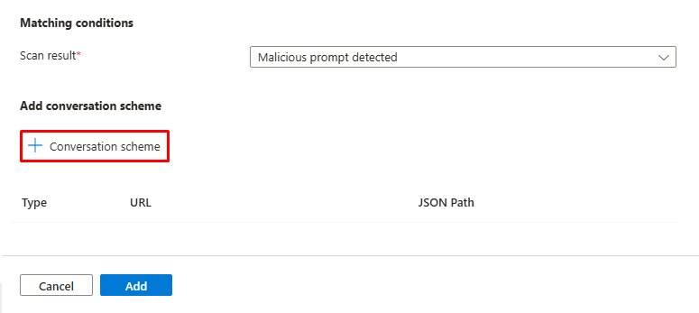
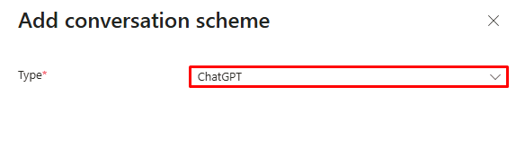
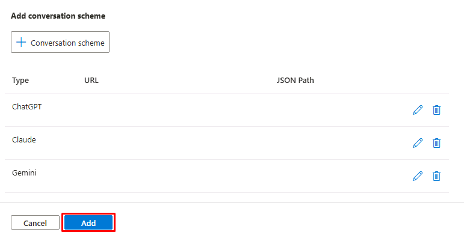
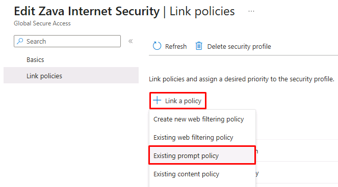
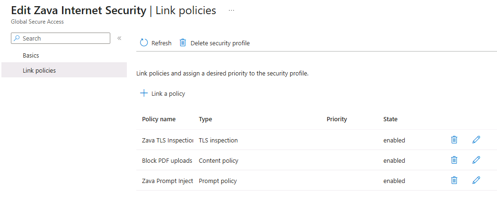

## Task 03: Block prompt injection attacks at the network layer

### Introduction
In this task, you'll create a prompt policy that scans outbound LLM requests for adversarial patterns (jailbreak attempts, instruction overrides, exfiltration prompts) and blocks them at the network layer before they reach the model.
### Description
Prompt injection attacks are the top OWASP-listed risk for LLM applications. An attacker crafts input designed to make the model ignore its system instructions, reveal sensitive data, perform unintended actions, or generate harmful content. Traditional application-layer defenses (input sanitization, prompt guards built into the app) could be bypassed and require code changes to update.
### Example scenario
You're Adele, pasting external content into an internal AI assistant. Hidden malicious instructions attempt to manipulate the response-but the system detects and blocks them before they reach the model.
### Success criteria
- Prompt policy active
- Adversarial prompts blocked
- Events logged for monitoring
### Learning resources
- Prompt injection protection

---

### Key steps

#### 01: Create the prompt policy

1. In the leftmost pane, go to **Global Secure Access** > **Secure** > **Prompt policies**.

1. On the top bar, select **Create policy**.

	

1. On the **Basics** tab, enter the following:

	| Item | Value |
	|---|---|
	| Name | `Zava Prompt Injection Protection` |
	| Description | `Blocks adversarial prompts to enterprise LLM endpoints from user devices.` |

1. Select **Next**.

1. On the **Rules** tab, select **Add rule**.

1. On the **Prompt Rule** page, enter the following:

	| Item | Value |
	|---|---|
	| Rule name | `Block adversarial prompts` |
	| Description | `Block rule for prompt injection / jailbreak patterns.` |
	| Action | **Block** |

	

1. Under **Add conversation scheme**, select **Conversation scheme**.

	

1. In the flyout pane:

	1. From the **Type** dropdown menu, select **ChatGPT**.

		

	1. Select **Add**.

	{: .important }
	>For custom LLMs, you'd select **Custom** and provide the endpoint URL and JSON path that points to where the prompt lives in the request body.

1. Repeat the steps to add additional conversation schemes for the following LLMs:

	- **Claude**
	- **Gemini**

	{: .note }
	> You can add as many schemes as you need. Each one expands the coverage of the prompt policy to another LLM provider.

1. At the bottom of the page, select **Add**.

	

1. Select **Next**.

1. Select **Create**.

---

#### 02: Link the prompt policy to the Zava Internet Security profile

You'll now attach the policy to the **Zava Internet Security** profile so it becomes part of the same Conditional Access-gated stack.

1. In the leftmost pane, go to **Global Secure Access** > **Secure** > **Security profiles**.

1. Select **Zava Internet Security**.

1. In the page's menu, select **Link policies**.

1. Select **Link a policy** > **Existing prompt policy**.

	

1. In the flyout pane:

	1. For **Policy name**, select **Zava Prompt Injection Protection**.

	1. At the bottom of the pane, select **Add**.

1. Observe the profile now shows three linked policies:

	- **Zava TLS Inspection Policy**
	- **Block uploads to ChatGPT**
	- **Zava Prompt Injection Protection**

	

	{: .note }
	> When **CA03** evaluates an end user's request to any internet resource, all three policies fire in sequence.

---

AI access now flows through the same policy engine that gates Adele's identity and the Finance Portal. Shadow AI exfiltration, MCP-speaking agents, and prompt injection are all visible and enforceable at the network layer, without requiring code changes to any application.

---

# Congratulations!

You've completed the lab.

Select **End** to mark the lab as **Complete**.